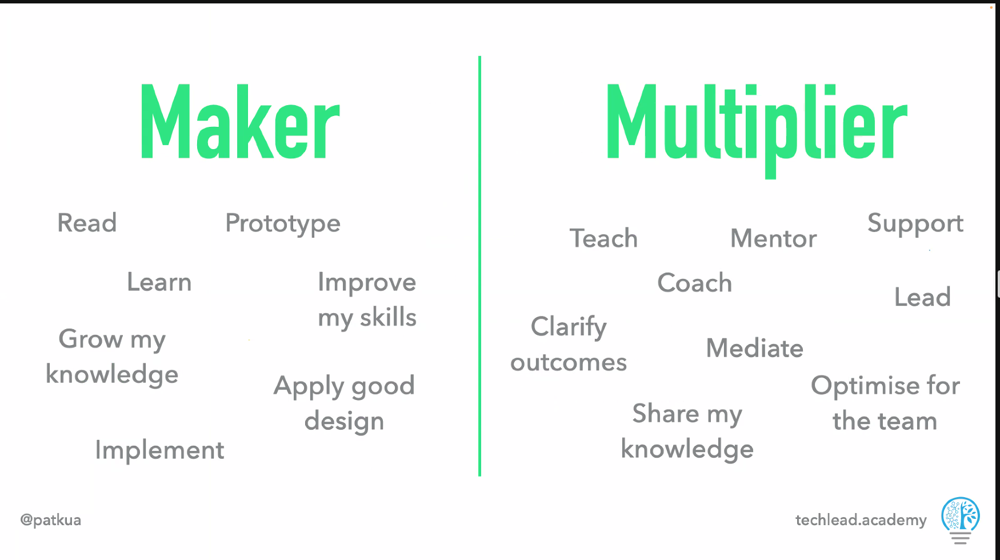
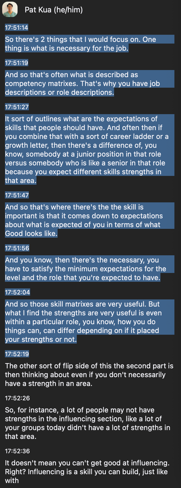
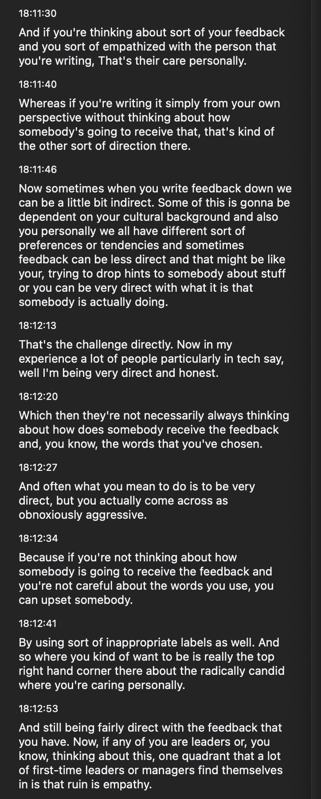

# Soft Skills for Techies

Investing in these core skills will make you effective in your day to day work.

If you start investing these early, it'll be easier for you in the future.

Agenda
- Teamwork
- Feedback
- Strengths
- Decisions
- Time Management
- Growth

Day 1
- Maker vs Multiplier
- Q&A Break
- Strengths
- Q&A Break
- Feedback
- Q&A
- Wrap Up

Started off with spliting into groups and finding the common interests. 
Got together with Seb, Yash and Puneet.

What is a Maker?

What is a Multiplier?

Maker Mindset
- "What I make"
- "What I build"
- "What I do"
- More Independent Work

Technology - no need to always create an elegant solution for an issue.

Multiplier Mindset
- "How I multiply others"
- "How I help others be successful"
- More Interdependent Work

What restricts people's effectiveness is if they effectively focus on the maker mode.

You should be a significant IC to your team but also improve impact by combining the two.

Brainstorm 2
- Sharing experiences
  - Focus on 2 areas
    - Part 1 - As individuals, silently brainstorm ideas that represent Maker and Multiplier behaviours
      - Maker
        - solely just focus on feature JIRAs / POCs
        - identify with one's own contribution
      - Multipler behavior
        - make everyone in the team feel open and willing to share
        - create a conducive environment within the team
        - identify with the team's contribution
    - Part 2 - Now discuss these in your groups and share examples

Why be a multiplier?
- A multiplier has more impact
- See your results on not how much you produce but how much you can enrich
- What "impact" do you have in your teams?

Questions to ask
- Are people working towards the same goal?
- Are we doing things in a similar format to allow people to contribute and move us closer tho the goals as closely as possible?

Why is this especially important for software teams?
- interdependencies
- need people with different skills and specialties
- knowledge (i.e domain, history)
- system dependencies
- task dependencies

Points
- capture the decisions/standards made on a page --> these decisions become part of the onboarding process (e.g. no single points of failure)

Strengths
- we tend to be more successful if we know and apply our strengths
- reinforcing cycle of confidence because its easier
- work on weaknesses that are holding you back

Book - strengths v2.0?

https://www.gallup.com/workplace/245090/cliftonstrengths-themes-quick-reference-card.aspx

Diverse strengths increase success
- we can't be good at all 34 domains. --> reason why we work in groups

Practical tips
- Increase awareness of the different strengths
- Recognize the strengths of people around you
- Encourage people to apply your strengths

Feedback --> most people think of dread, tension, what should I be doing differently?
- this is because people give ineffective feedback

How to give effective feedback?
- a skill that needs to be cultivated.
- "thanks for the feedback"

Think of a recent situation where you had an opportunity to offer feedback to someone.

Notice that your feedback should contain a consequence of that feedback. consider the "impact" of the feedback.
"I noticed you interrupted charlie 4 times during the meeting. And then afterwards, Charlie stopped contributing to the meeting"

Don't be too general / abstract.

"You provide good code reviews" --> less effective --> not specific enough

Effective feedback
- when you receive feedback, what do you ask yourself?
- What I can do more of? What can I do differently?
 
Effective feedback should serve 2 purposes
- strengthening confidence (do more)
- improve effectiveness (do differently)
  - should help the ??

Feedback Formula
- Situation (last night)
- Behavior (you interrupetd charlie 4 times during his presentation about xxx)
- Impact (I noticed he stopped contributing xx)

Some Tips
- Be as specific as possible
- Use "I-Language" for impact (use "I feel", "I think", to change the POV)
- Don't YOLO feedback

Feedback is a gift
- Given an inapropriate time
- May be poorly wrapped
- May be not useful (thank/acknowledge)
- May be unwanted (thank/acknowledge)

Teamwork
- think of the best and worst team experiences that you've worked on

Project Aristotle
1. Psychological Safety: Feeling safe to take risks, share ideas, and admit mistakes without fear of judgment or negative consequences.
   - How can we improve the team's psychological safety? 
     - Becareful of how much you're talking. Make sure others have space to talk in Team meetings
2. Dependability: Knowing team members will deliver on their commitments and handle their assigned tasks effectively.
   - Make sure you are working with a backup buddy
3. Structure & Clarity: Having clear goals, roles, and expectations within the team, allowing everyone to understand their part in the overall process.
   - As a teammate, do I know what is expected of me etc.
   - A good onboarding process can help with this, - how the team works, does the team do daily standups, what team rituals does the team have
   - Are teams documented and clear?
4. Meaning: Feeling a sense of purpose and value in the team's work, knowing it contributes to something larger than individual goals.
5. Impact: Believing the team's work makes a real difference and has a positive impact on users or the organization.
   - Is the work I'm doing have a impact?
   - What feedback loops do you have to make sure that the work that you do has constant impact?

The thing about this project is that there are a lot of assessments and ideas to improve this online --> TODO: research

Communication
1. Active Listening
  - Do
    - Repeat what you hear
    - Listen for specific words
    - Listening for meaning
    - Paraphrase
  - Do Not
    - Problem Solve
    - Think about what you would do
    - Are they asking for input/feedback/solution? Clarify what they are asking for before jumping into solving mode
    - Provide advice
2. 3 types of Conversation - this is a book (READ IT)
   - What Happened (Conversation focused on these elements)
     - Different facts
     - Different opinions
     - Blind men and the elephant
   - Feelings (Converastion focused on these feelings) - people just want to be heard
     - Anger
     - Upset
     - Excitedness
   - Identity - people want to feel safe, productive and that they'll adding value to the workplace.
     - "C" Developer. E.g. when you work as a C developer for 15 years and then asked to do Java. This will scare you as you'll lose the psychological safety, etc
       - What we need to do here is to provide the C Developer psychological safety.

Tips
- Introspect on "how" you communicate
- Consider "where/when" you communicate
- "Are you speaking the same language"?
- What is your core message? When you speak to Senior people, need to know about your "ask"

# Decisions

- Knowledge/Skill + Luck/Environment = Outcome
- Decisions are bets - Making Smarter Decisions
- As you follow the decision making process, that's the best
- Make your decisions look reversible

How to make your decisions reversible?
- Ports and adapter architecture (what is this?)
- Prototype (PoC / Spikes)
- Feature flags
- High cohesion / Low coupling
- Automated testing (end to end)
- Time boxed experiment
- Scope based experiment
- What does "good" look like?
- Monitor data (e.g. success factor)

# Time Management
Interruptions < context switching > Ineffecitve meetings

When you get interrupted a lot, keep track of them and notice any patterns to them
Balancing "Being helpful" vs "Losing focus"

Interruptions / Context switching --> do it more within your team and less outside your team

Consolidate similar meetings / related activites into a single block
- keep interview to a single day / standard blocks of time

Idea is to have as much focused time as possible.

Inside the team
- Synchornize planning/review time as team (daily standup review retrospective )
- Agree on a nomiated pair
- Agree on communication channels (and purpose) - agree on a block of time where you only respond to messages (e.g. afternoons)
- Disable notifications (depends)
- Remind people that email/chat is async --> meetings is synchronous
  - "Does this need real time feedback"

Outside of the team
- define 2 team contact channels (e.g. general and emergency)
- Experiment with rotating production support / xxx guy to respond to prod incidents & hd-tickets
- See slides

5P's of effective meetings
1. Is there a clear purpose?
      - Recommend to have a few segments and clear purpose if there are many purpose for one meeting 
      - e.g. one meeting to brainstorm ideas -> break -> meeting to shortlist -> break -> finalize
2. Do you have the right participants
3. Is there a clear process (e.g. Agenda)

# Growth

Finding Flow
- different activites (finding)
- different skills, do things that you've never done but your team has did
- different teams to rotate to