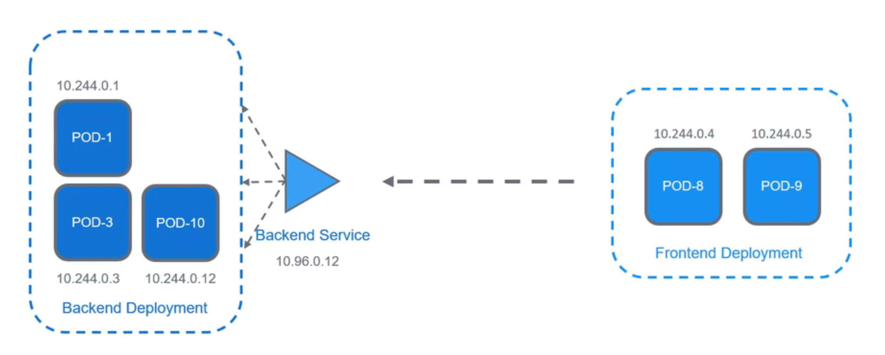

### Kubernetes Services
- We need the pods of each application to connect to each other.
- Given that pods are ephemeral and scales up/down with different IPs, we can use the service resource to help the applications connect o each other.

3 types of services in kubernetes:
- NodePort
  - accessible outside the cluster
- ClusterIP
  - for internal use within the cluster only
- Loadbalancer
  - supported by specific Cloud Providers / MetalLB
  - similar to NodePort service but use a loadbalancer to redirect traffic

### Sidecars
In Kubernetes, a sidecar container is a container deployed alongside another container within the same pod. The sidecar container provides additional functionality to the main container, such as logging, monitoring, or security. Sidecar containers are often used to implement application-specific functionality that is not easily integrated into the main container.

A Istio sidecar is a specific type of sidecar container that is used to implement the Istio service mesh. Istio is a platform-independent service mesh that provides traffic management, observability, and security for microservices. The Istio sidecar container is responsible for intercepting all of the traffic to and from the main container and applying Istio's policies and controls. This allows Istio to provide a consistent set of features across all of the microservices in a deployment.

Here are some of the benefits of using Istio sidecars:

Traffic management: Istio sidecars can be used to route traffic between microservices, implement circuit breakers, and retry failed requests.
Observability: Istio sidecars can collect metrics and logs from microservices and send them to a centralized monitoring system.
Security: Istio sidecars can enforce authentication and authorization policies, and can also be used to encrypt traffic between microservices.
Istio sidecars are a powerful tool for managing and securing microservices. They can be used to improve the performance, reliability, and security of microservices applications.

Here is a diagram that shows how Istio sidecars work:

 

Istio sidecar diagramOpens in a new window
istio.io
Istio sidecar diagram
As you can see, the Istio sidecar container intercepts all of the traffic to and from the main container. The sidecar container can then apply Istio's policies and controls to the traffic before it is forwarded to the main container.

### Envoy Proxy
#### Envoy and Istio: A Symbiotic Relationship

In the realm of microservices architecture, Envoy and Istio stand as two prominent players. While they may seem distinct, their relationship is one of synergy, where Envoy serves as the data plane powerhouse and Istio acts as the control plane maestro.

#### Envoy: The Data Plane Dynamo

Envoy is an open-source, high-performance edge and service proxy built on C++. It serves as the backbone of Istio's data plane, handling the intricacies of network traffic management for microservices.

Envoy's capabilities are vast, encompassing:

- Dynamic Service Discovery: Envoy seamlessly discovers services within the mesh, enabling efficient communication between them.

- Load Balancing: Envoy intelligently distributes traffic across multiple service instances, ensuring optimal performance and availability.

- HTTP/2 and gRPC Proxying: Envoy acts as a proxy for HTTP/2 and gRPC traffic, handling protocol conversion and routing.

- Circuit Breakers: Envoy safeguards against cascading failures by implementing circuit breakers, preventing overload and ensuring service resilience.

- Health Checks: Envoy continuously monitors service health, ensuring only healthy instances receive traffic.

- Staged Rollouts: Envoy facilitates gradual rollouts of new service versions, minimizing disruption and ensuring stability.

- Fault Injection: Envoy enables deliberate injection of faults, allowing for proactive testing and resilience improvement.

- Rich Metrics: Envoy provides comprehensive metrics, enabling deep insights into network behavior and performance.

#### Istio: The Control Plane Conductor

Istio, on the other hand, operates at the control plane level, orchestrating the overall behavior of the service mesh. It utilizes Envoy as its data plane envoy, providing centralized configuration and management.

Istio's responsibilities include:

- Traffic Management: Istio defines traffic routing rules, enabling fine-grained control over service communication.

- Security: Istio enforces authentication and authorization policies, safeguarding services and data.

- Observability: Istio collects and aggregates telemetry data, providing comprehensive insights into service performance and behavior.