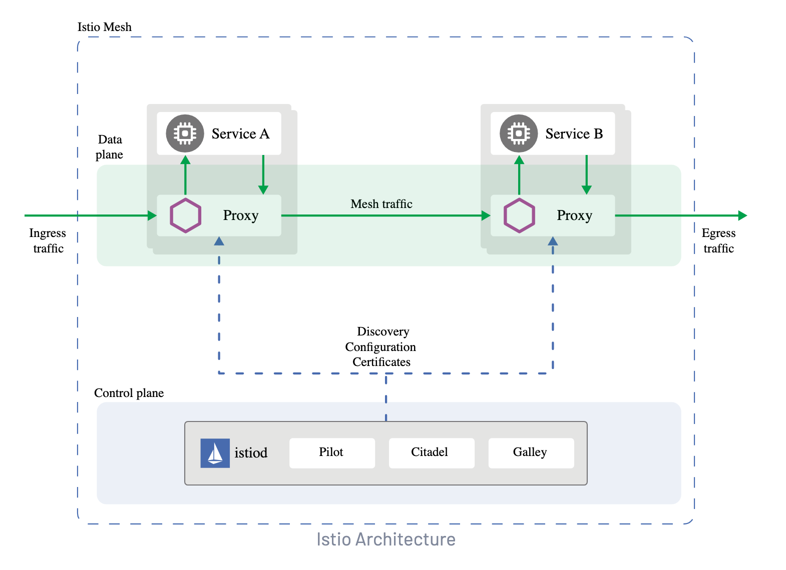

### Service Mesh
Service mesh is a dedicated and configurable infra layer that handles communication between services without having to change the code in a microservice architecture

Security
- Provides dynamic configuration on how services talk to another one with mutual TLS.

Observability
- Good logging with issues and bottlenecks.

Service Discovery
- Discovery - which IP and Port services are exposed so that they can find each other
- Health Check
- Load Balancing for healthy applications

Istio is composed of two main components:

- Data plane: The data plane is responsible for routing traffic between microservices. It is composed of a set of proxies, which are deployed alongside each microservice. The proxies are responsible for intercepting and forwarding traffic, and for enforcing Istio's policies.

- Control plane: The control plane is responsible for configuring the data plane. It is a collection of services that provide a centralized way to manage Istio's policies and configuration.



### Istio
Istio utilizes Proxies such as Envoy. There proxies talk to a server side component aka control plane.

Control plane is made up of 3 components
- Citadel
  - certificate generation
- Pilot
  - service discovery
- Galley
  - validating configuration files

All these components are combined into a single daemon called istiod.

# Installing Istio / Istioctl
3 approaches to install Istio
- install with IstioCTL
- Istio Operator
- Istio Helm Chart

For KodeKloud, we use istioctl to install

```
# Note that there are different profiles for production and performance testing
# different environments need different profiles
istioctl install --set profile=demo -y
istioctl verify-install # To check for Istio is successfully installed
```

After installation,
- istio-system namespace will be created
- istiod pods
- istio-ingressgateway
- istio-egressgateway

```
# Download istio binary
curl -L https://istio.io/downloadIstio | sh -

# Find out verison of istio running
istioctl version
```

### Deploying First application on Istio

```
# Commands
# Will analyze the current namespace and context for you to any issues
istioctl analyze 
```

Must enable Istio sidecar injection at a namespace level if you would like Istio to inject proxy services as side cars to the applications deployed in a namespace


```
# To do this on a specific namespace
kubectl label namespace plat-default istio-injection=enabled

# If you want to disable, change enabled to disable.
```

Once this is ran, every new app in the plat-default namespace will get a side car automatically

Then verify with
```
istioctl analyze
```

#### Lab Questions
1. Istio helps serviecs to communicate with each other without needing to change application code - Tture


### Visualizing Service Mesh with Kiali
Kiali is used for observing connections and microservices of Istio service mesh and also for defining and validating them

It visualize the service mesh topology and provide visbility into features like request routing, circuit breakers, request breaks and more.

Also offers wizards to apply ??

```
# Install kiali on cluster via operator
helm repo add kiali https://kiali.org/helm-charts
helm repo update
helm install kiali-operator \
  --namespace istio-system \
  --set auth.strategy="anonymous" \
  https://kiali.org/helm-charts/kiali-operator

kubectl apply -f 
apiVersion: kiali.io/v1beta1
kind: Kiali
metadata:
  name: kiali
spec:
  installationMode: operator
  selector:
    namespaces:
      - istio-system

kubectl rollout status deployment/kiali -n istio-system

# access kiali dashboard
istioctl dashboard kiali

# Without operator
https://kiali.io/docs/installation/installation-guide/install-with-helm/
```
