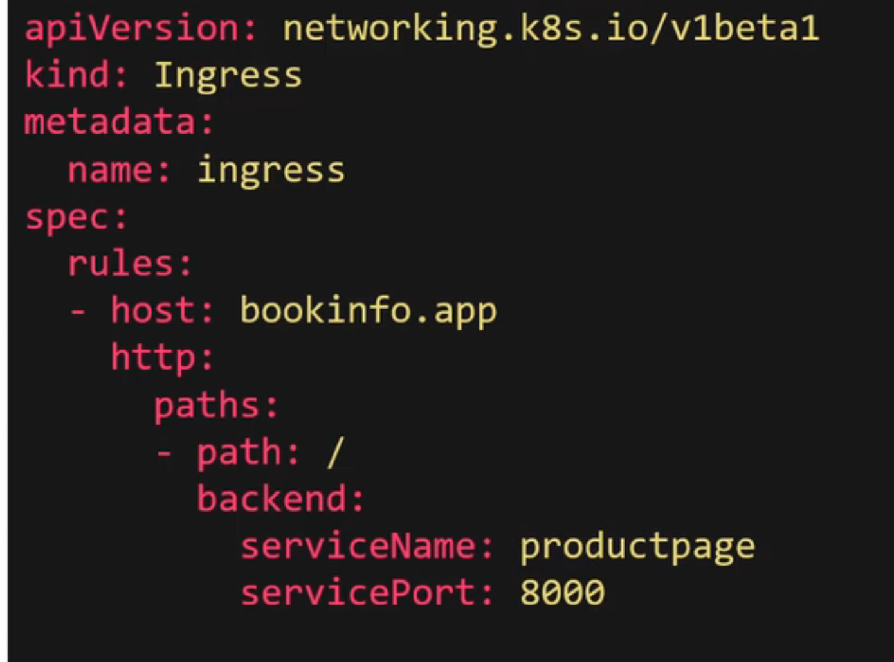
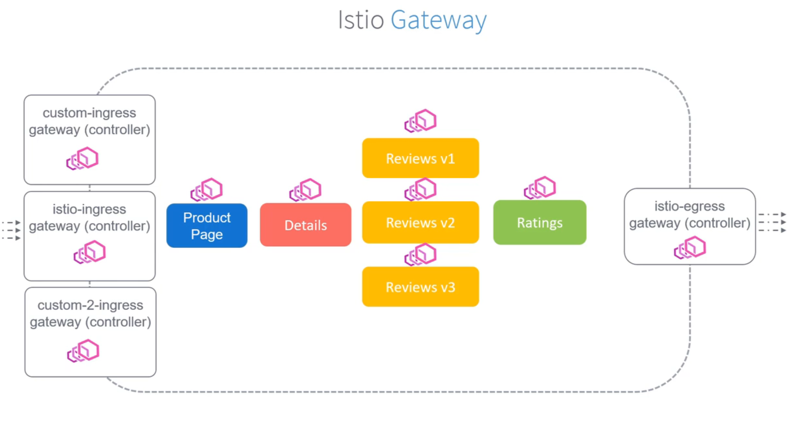
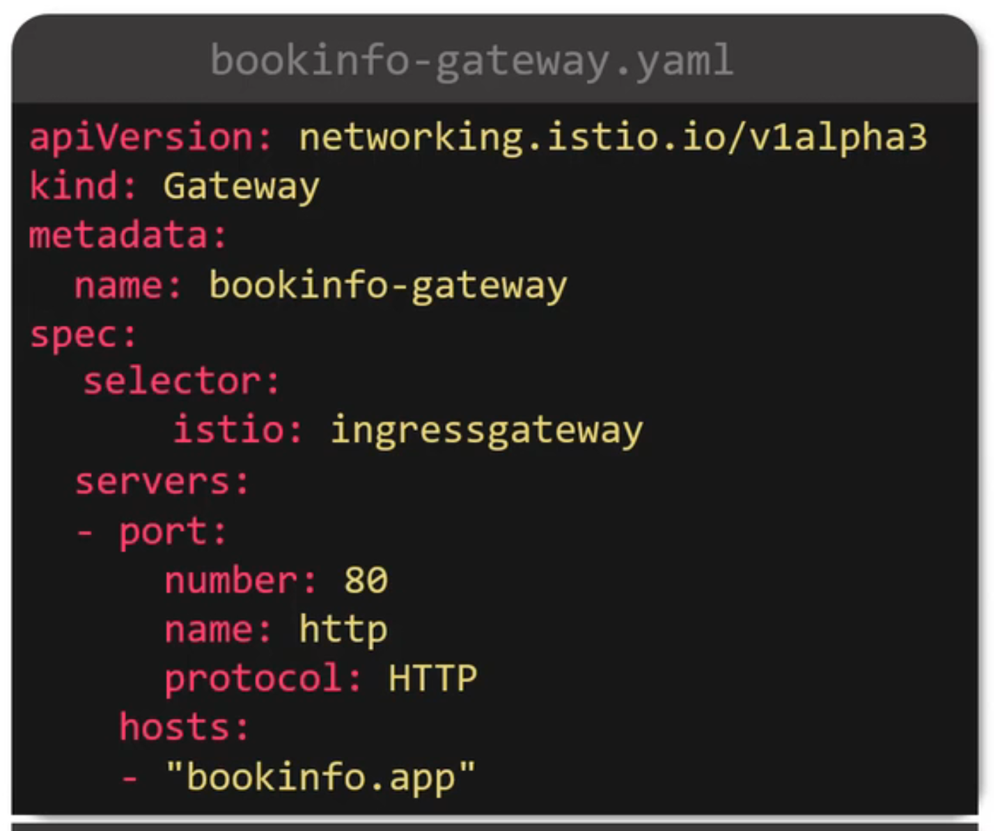
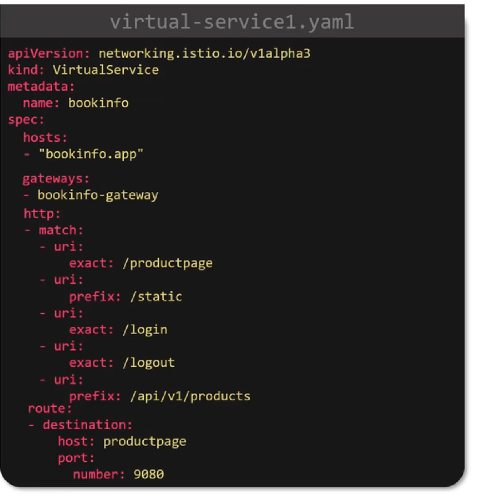
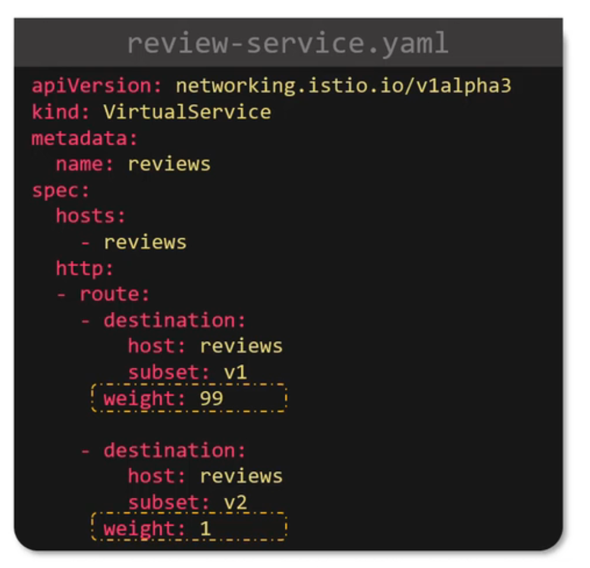
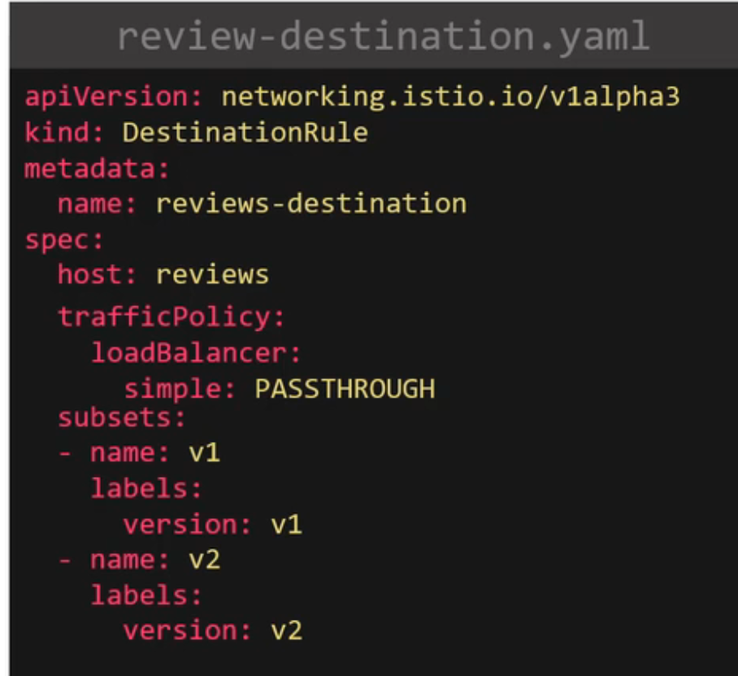
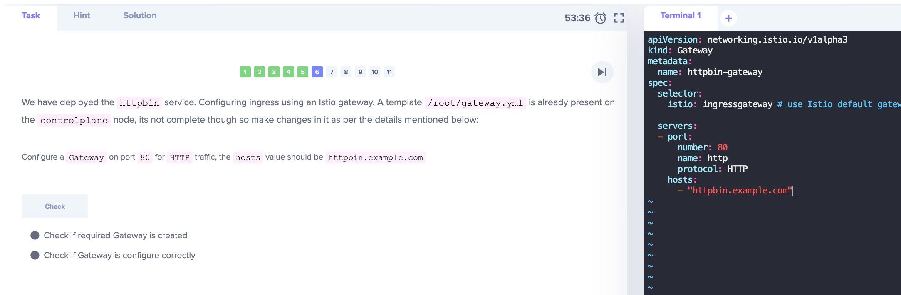
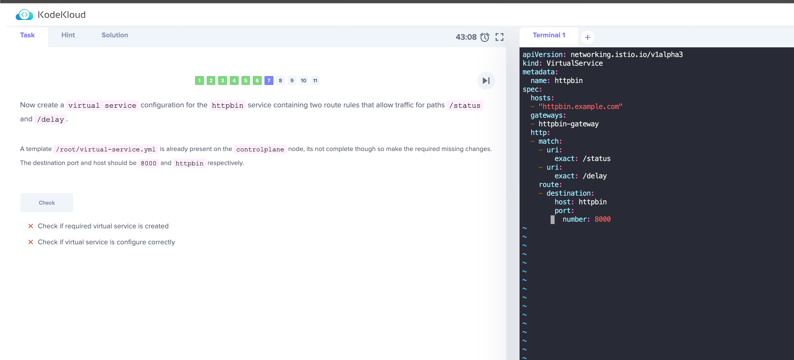
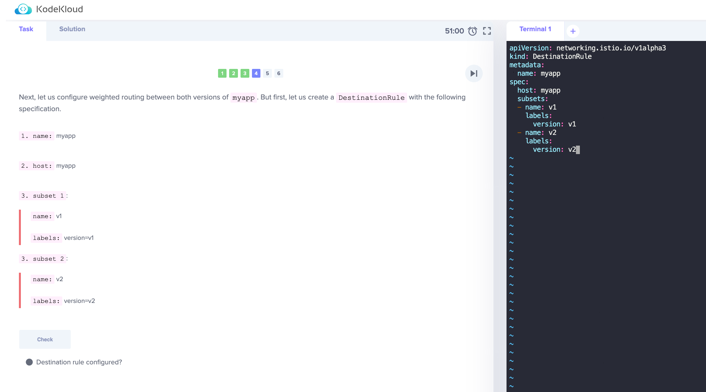
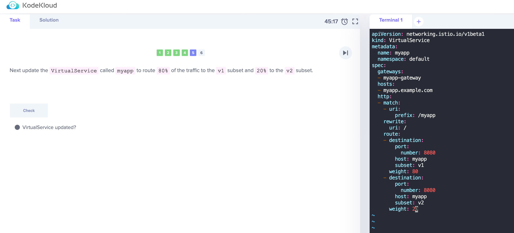

#### Introduction
N/A

#### Gateways
How can we make these services accesible to external users?

##### First method - Ingress

When someone accesses "http://bookinfo.app" they should access the application.

With ingress, we can direct traffic to route traffic with a specific host header to the appropriate service (Istio supports this)

e.g 

##### Second method - Istio Gateway

This is recommended by Istio that supports more Istio features such as monitoring/routing

Gateway - loadbalancers that sit at the edge of the mesh 
- manages inbound and outbound traffic at service mesh
- istio-ingressgateway (default controller for envoy to sync with services)
- istio-egressgateway (default controller for envoy to sync with services)
- deploys ingress gateway using envoy proxies while Ingress utilizes nginx
- can have custom gateway controllers

```yaml
# This YAML file defines a simple Gateway named myapp-gateway.
# It selects the istio-ingressgateway pod and exposes a single HTTP port (80) for external traffic.
# Any incoming requests on port 80 and any host will be routed through this gateway
# Things to learn:
# This example demonstrates the basic structure of a Gateway resource.
# It shows how to select the Istio Ingress Gateway for handling external traffic.
# It exposes a single port for HTTP traffic but can be easily extended to handle other protocols and ports.

apiVersion: networking.istio.io/v1alpha3
kind: Gateway
metadata:
  name: myapp-gateway
spec:
  selector:
    app: istio-ingressgateway
  servers:
  - port:
      number: 80
      name: http
      protocol: HTTP
    hosts:
    - "*"

```
```yaml
# This example defines a more advanced Gateway named secure-ingress-gateway. It exposes two ports:

# HTTPS port (443): This port is secured with TLS using a secret named myapp-tls-secret. It only accepts traffic for the host mysecureapp.example.com.
# HTTP port (80): This port is used for unencrypted traffic and accepts requests for any host.
# Things to learn:

# This example demonstrates how to configure a Gateway with TLS for secure communication.
# It shows how to use a secret to store the TLS certificate and key.
# It demonstrates the use of multiple servers for different ports and protocols.
# It highlights how to restrict access based on hostnames.
apiVersion: networking.istio.io/v1alpha3
kind: Gateway
metadata:
  name: secure-ingress-gateway
spec:
  selector:
    app: istio-ingressgateway
  servers:
  - port:
      number: 443
      name: https
      protocol: HTTPS
    hosts:
    - "mysecureapp.example.com"
    tls:
      mode: SIMPLE
      secretName: myapp-tls-secret
  - port:
      number: 80
      name: http
      protocol: HTTP
    hosts:
    - "*"

```

```
# To list the gateways
kubectl get gateway
```

Notice how when we create a gateway, we need to include the ingress controller name there, in the following example, we use the default. When do we not use the default?



#### Virtual Services

 Istio introduces a new concept called a VirtualService, which adds an extra layer of abstraction and control over service traffic routing.

Here's a breakdown of what a VirtualService is and why it matters:

##### Purpose:
- A VirtualService defines a set of traffic routing rules to apply to a Kubernetes service or subset of a service.
- It acts as an abstraction layer on top of the actual service implementation, allowing you to define routing behavior independently.
- This decoupling enables greater flexibility and control in managing service traffic routing.
  
##### Key Features:

- Route traffic: Define rules based on various criteria like HTTP headers, path, source labels, etc.
- Load balancing: Distribute traffic across multiple instances of a service based on different algorithms.
- Traffic splitting: Send a percentage of traffic to different destinations for A/B testing or canary deployments.
- Fault injection: Introduce controlled failures to test service resilience and recovery mechanisms.
- Destination selection: Specify which versions or subsets of a service to route traffic to.
- Security: Implement features like authentication, authorization, and encryption for secure communication.

##### Benefits:

- Simplified service management: Manage routing rules centrally without modifying service implementations.
- Increased flexibility: Implement complex routing scenarios with ease.
- Improved observability: Gain insights into traffic flow and behavior.
- Enhanced security: Implement advanced security policies for traffic control.

##### Comparison with Kubernetes Service:

- A VirtualService is not a replacement for a Kubernetes Service. It acts as an additional layer to define routing behavior.
- While a Kubernetes Service defines the location and port of a service, a VirtualService defines how traffic gets routed to that location.

##### Think of a VirtualService as a traffic director:

- It receives incoming requests, analyzes them based on defined rules, and directs them to the appropriate destination within your service.
- This allows you to create sophisticated routing strategies, improve service resilience, and enhance the overall security of your application.


All routing rules are configured in the virtual service.

Routing rules are configured in the virtual service to route traffic coming from ingress gateway to service mesh
- can manage traffic with different versions of service
- when virtual service is created, istio will sync it with all the envoy sidecar proxies



Routing a small % of traffic to other versions of the application for testing
- [NATIVE] On a normal vanilla kubernetes cluster without Istio, how would we do this?
  - We create a service with a spec.selector.app=reviews
  - We create 3 different deployments (v1,v2,v3), each with a spec.template.metadata.labels.app=reviews
  - With this, all traffic going to service "reviews" will hit the 3 different deployments
  - We can then scale the deployments via the number of replicas to X number e.g. after more testing, scale to v2 and v3 more, and scale v1 to 0
  - Challenges faced
    - can't have more granularity e.g. if want only 1% to v2 (since service "reviews" will distribute traffic equally)
- With Istio VirtualService, you can do this
  - 
  - How to configure the subset?


#### Destination Rules

Destination Rules in Istio play a crucial role in shaping how traffic behaves once it reaches its intended destination.

Here's a breakdown of what Destination Rules are and their significance:

##### Purpose:

- A Destination Rule defines traffic policies for specific service instances or subsets within a Kubernetes service.
- It allows you to configure settings like load balancing, circuit breakers, timeouts, and retries for individual service instances or groups.
- This fine-grained control helps you optimize performance, resilience, and security for individual service components.

##### Key Features:

- Traffic policies: Configure load balancing algorithms, timeouts, retries, circuit breakers, and more.
- Subsets: Define specific groups of service instances with different traffic policies.
- Port-level configuration: Apply policies to specific ports within a service.
- Outbound traffic management: Control traffic originating from a service to other services.
- Traffic mirroring: Send a copy of traffic to another destination for debugging or monitoring purposes.

##### Benefits:

- Fine-grained control: Tailor traffic policies to specific service needs.
- Improved performance: Optimize load balancing for high availability and scalability.
- Enhanced resilience: Implement circuit breakers and retries for graceful degradation.
- Increased security: Apply security policies on a per-service basis.

##### Comparison with Virtual Services:

- While Virtual Services focus on routing incoming traffic to specific destinations, Destination Rules manage how traffic behaves once it reaches its target.
- They work in conjunction with Virtual Services to provide comprehensive traffic management capabilities.

##### Think of a Destination Rule as a traffic manager:

- It receives incoming traffic at a specific service instance or subset and applies configured policies to ensure optimal performance, resilience, and security.
- This allows you to fine-tune how individual service components handle traffic, leading to a more robust and efficient overall architecture.

##### Subset 
With reference to the virtual service yaml file above, there is this "subset" - v1/v2. Where is this subset defined?
- in the destination rule



##### Other Configuration
- You can configure each subset to have their own loadbalacing policies
- you can configure TLS/Mutual TLS
- use FQDN over shortnames is recommended (e.g. reviews.default.svc.cluster.local)
#### Demo

#### Fault Injection

##### Introduction:

- Fault injection is a powerful technique for testing the resilience and fault tolerance of your microservices architecture. 

- By deliberately introducing controlled failures, you can identify weaknesses in your system and ensure it can handle unexpected events gracefully. Istio provides a robust framework for performing fault injection on your services, allowing you to inject various types of failures and analyze their impact.

##### Benefits:

- Improved service resilience: Identify and address potential issues before they affect production.
Enhanced observability: Gain insights into how your system behaves under stress.
- Increased confidence in deployments: Deploy new versions with less risk of regressions.
- Faster troubleshooting: Locate and fix service problems more quickly.

##### Types of faults in Istio:

- Network delays: Simulate network latency to test service behavior under slow connections.
Aborts: Inject aborts to study how services handle unexpected terminations.
- Errors: Trigger specific errors to test error handling mechanisms.
Throttles: Limit traffic to a service to simulate resource constraints.
##### Istio Fault Injection Concepts:

- Virtual Services: Define how traffic is routed and where fault injection is applied.
- Destination Rules: Configure traffic policies for specific service instances or subsets.
- Fault Injection Rules: Specify the type, severity, and percentage of faults to inject

##### Examples

1. Virtual Service with Fault Injection:
- This Virtual Service routes all traffic to the myapp service. However, it also injects a 5-second delay with a 50% chance. This simulates network latency and allows for testing how the service behaves under slow connections.

```yaml
apiVersion: networking.istio.io/v1alpha3
kind: VirtualService
metadata:
  name: myapp-fault-injection
spec:
  hosts:
  - myapp.example.com
  gateways:
  - myapp-gateway
  http:
  - route:
    - destination:
        host: myapp
        port:
          number: 8000
    fault:
      delay:
        fixedDelay: 5s
        percentage:
          value: 50

```

2. This Destination Rule defines outlier detection for the myapp service. If a pod within the v1 subset experiences five consecutive errors within a 10-second window, it will be ejected from the load balancer for 30 seconds. This helps to prevent unhealthy pods from impacting service performance.

```yaml
apiVersion: networking.istio.io/v1alpha3
kind: DestinationRule
metadata:
  name: myapp
spec:
  host: myapp
  subsets:
  - name: v1
    labels:
      version: v1
  outlierDetection:
    consecutiveErrors: 5
    interval: 10s
    baseEjectionTime: 30s

```

Testing:

Deploy these YAML files and access your service. You should observe the injected delays 50% of the time. Additionally, if a pod within the v1 subset starts generating errors, it will be automatically ejected from the load balancer, preventing further issues.

#### Timeouts
- Deployed only on a virtualservice level
- In any distributed system, timeouts play a crucial role in ensuring service stability and responsiveness.
- They prevent applications from hanging indefinitely waiting for responses from other services and enable graceful handling of network issues or service delays.
- Istio provides robust functionalities for setting timeouts across various aspects of service communication, including:

1. Request Timeouts:

These define the maximum time a client waits for a response from a service. If the service doesn't respond within the specified timeout, the client receives an error and can retry the request or failover to another service.

2. Connection Timeouts:

These determine how long a client waits for a connection to be established with a service. If the connection cannot be established within the timeout, the client receives an error and can retry the request.

3. Gateway Timeouts:

These specify the maximum time the Istio gateway waits for a response from an upstream service. This helps prevent the gateway from overloading if a service is slow or unresponsive.

##### Benefits of using timeouts in Istio:

- Improved service stability: Timeouts prevent cascading failures and ensure overall system responsiveness.
- Enhanced fault tolerance: Services can gracefully handle slow or unresponsive dependencies and avoid getting stuck waiting.
- Better resource utilization: Timeouts prevent resources from being tied up by unresponsive services and optimize resource allocation.
- Improved debugging and troubleshooting: Timeouts help identify and diagnose issues with slow or unresponsive services.

```yaml
# Example 1: Setting Request Timeout on a Virtual Service
# This example sets a 5-second request timeout on the myapp-vs Virtual Service.
# If the myapp service does not respond within 5 seconds, the client will receive an error.
apiVersion: networking.istio.io/v1alpha3
kind: VirtualService
metadata:
  name: myapp-vs
spec:
  hosts:
  - "myapp.example.com"
  http:
  - route:
    - destination:
        host: myapp
        port:
          number: 8000
    timeout: 5s
```

```yaml
# Example 2: Setting Connection Timeout on a Destination Rule
# This example sets a 2-second connection timeout on the myapp Destination Rule.
# If the client cannot establish a connection with the myapp service within 2 seconds, it will receive an error.
apiVersion: networking.istio.io/v1alpha3
kind: DestinationRule
metadata:
  name: myapp
spec:
  host: myapp
  trafficPolicy:
    connectionPool:
      tcp:
        connectTimeout: 2s

```

Timeouts work hand in hand with Fault Injection for testing
```yaml
# This Virtual Service routes traffic to the downstream-service on the /critical-path path.
# It also injects a 10-second delay with a 50% chance to simulate slow responses.
# Additionally, it sets a 5-second timeout to ensure the client doesn't hang indefinitely if the service is unresponsive
apiVersion: networking.istio.io/v1alpha3
kind: VirtualService
metadata:
  name: myapp-vs
spec:
  hosts:
  - "myapp.example.com"
  http:
  - match:
    - uri:
        exact: /critical-path
    route:
    - destination:
        host: downstream-service
        port:
          number: 8000
    fault:
      delay:
        fixedDelay: 10s
        percentage:
          value: 50
    timeout: 5s

```
```yaml
# This Destination Rule defines outlier detection for the downstream-service.
# If the service experiences five consecutive errors within a 10-second window, it will be ejected from the load balancer for 30 seconds.
# This helps prevent unhealthy instances from impacting service performance and further failure
apiVersion: networking.istio.io/v1alpha3
kind: DestinationRule
metadata:
  name: downstream-service
spec:
  host: downstream-service
  trafficPolicy:
    outlierDetection:
      consecutiveErrors: 5
      interval: 10s
      baseEjectionTime: 30s
```
Deploy these YAML files and observe the behavior of your service. You should see the following:

- 50% of requests to the /critical-path path will experience a 10-second delay.
- If the response from the downstream service takes longer than 5 seconds, the client will receive an error.
- If the downstream service experiences five consecutive errors, it will be ejected from the load balancer, preventing further issues.
- By analyzing these results, you can identify potential bottlenecks and improve the performance and resilience of your service.
- You can adjust the delay duration, timeout values, and failure thresholds to test different scenarios and gain deeper insights into your system's behavior

#### Retries

```yaml
# If no specify retry, the default is
# retry behavior 25ms between retries
# attempts: 2
apiVersion: networking.istio.io/v1alpha3
kind: VirtualService
metadata:
  name: myapp-vs
spec:
  hosts:
  - "myapp.example.com"
  http:
  - route:
    - destination:
        host: downstream-service
        subset: v1
    retries:
      attempts: 3
      perTryTimeout: 2s
    timeout: 5s

```

#### Circuit Breaking

Circuit breaking is an important pattern for creating resilient microservice applications. Circuit breaking allows you to write applications that limit the impact of failures, latency spikes, and other undesirable effects of network peculiarities

- Limit the impact of failures / network related issues
- Configured in destination rules
```yaml
Connection Pool:

# tcp:
# maxConnections: Limits the number of concurrent TCP connections to the httpbin service to 1. This prevents resource overload and ensures efficient resource utilization.
# http:
# http1MaxPendingRequests: Limits the number of pending HTTP requests to 1. This prevents the client from sending too many requests at once, which could overwhelm the httpbin service.
# maxRequestsPerConnection: Limits the number of HTTP requests per TCP connection to 1. This optimizes resource usage and ensures efficient communication between the client and the httpbin service.
# Outlier Detection:

# consecutive5xxErrors: Triggers outlier detection if the httpbin service returns five consecutive 5xx error responses within a specific time interval.
# interval: Sets the time interval for outlier detection to 1 second. This defines the window within which consecutive errors are considered for triggering outlier detection.
# baseEjectionTime: Ejects the httpbin service from the load balancer for 3 minutes if it is identified as an outlier. This allows the service to recover from its unhealthy state before accepting further traffic.
# maxEjectionPercent: Limits the maximum percentage of ejected instances in the load balancer to 100%. This ensures that some healthy instances remain available to handle incoming requests

apiVersion: networking.istio.io/v1alpha3
kind: DestinationRule
metadata:
  name: httpbin
spec:
  host: httpbin
  trafficPolicy:
    connectionPool:
      tcp:
        maxConnections: 1
      http:
        http1MaxPendingRequests: 1
        maxRequestsPerConnection: 1
    outlierDetection:
      consecutive5xxErrors: 1
      interval: 1s
      baseEjectionTime: 3m
      maxEjectionPercent: 100
```

#### A/B Testing
N/A

#### Labs





