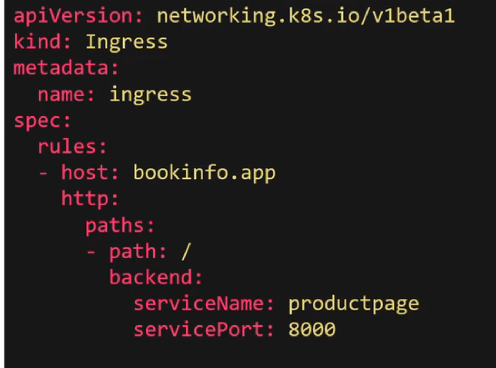

## Introduction
N/A

## Gateways
How can we make these services accesible to external users?

When someone accesses "http://xxx.app" they should access the application.

With ingress, we can direct traffic to route traffic with a specific host header to the appropriate service

e.g 
## Virtual Services

## Destination Rules

## Demo

## Fault Injection

## Timeouts

## Retries

## Circuit Breaking

## A/B Testing