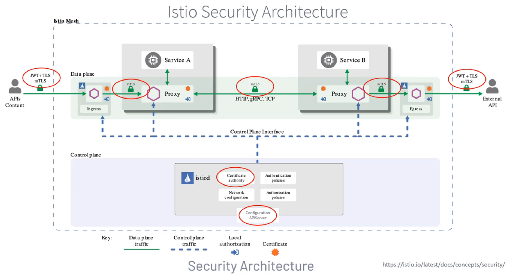
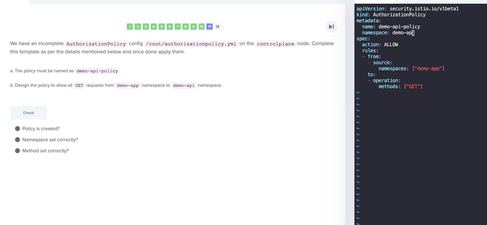

### INTRO
### SECURITY IN ISTIO
When service communicates to another service, possible for attacker to intercept and modify msg (MITM). Need for ACL + Encryption

mTLS
- resolves access control need
- encryption

### ISTIO SECURITY ARCHITECTURE
Within istiod, there is a Certification Authority that manages keys and certificates in Istio. 
- certificates are validated here
- certificate signing requests are approved here
- everytime a workload is started, the envoy proxies request the cert and key from the Istio agent and that helps to secure communication between services

Configuration APIServer distributes all authorization, authentication and securing naming policies to the proxies

Sidecars and ingress/egress proxies work as Policy Enforcement Paths

Every point has security checks


### AUTHENTICATION
When a service tries to communicate to another service, there must be a way to confirm they're who really they say they are. This is done via
- mTLS
  - each service gets its own identity, enforced by certificate key pairs. This cert generation, distribution is managed automatically by Istiod
- JWT
  - authentication for end user access to services


PeerAuthentication CRD
```yaml
# Enforce mTLS for all services in the xxxx namespace
apiVersion: security.istio.io/v1beta1
kind: PeerAuthentication
metadata:
  name: default
  namespace: xxxx
spec:
  mtls:
    mode: STRICT
```

```yaml
# Enforce mTLS for all services in the istio mesh
apiVersion: security.istio.io/v1beta1
kind: PeerAuthentication
metadata:
  name: default
  namespace: istio-system
spec:
  mtls:
    mode: STRICT
```

```yaml
# Enforce mTLS for a specific workload with label app: my-specific-workload
apiVersion: security.istio.io/v1beta1
kind: PeerAuthentication
metadata:
  name: my-specific-workload-mtls
  namespace: xxxx
spec:
  selector:
    matchLabels:
      app: my-specific-workload
  mtls:
    mode: STRICT

```

```yaml
# This RequestAuthentication policy named jwt-example is applied 
# to the workload with the label app: httpbin in the foo namespace1.
# It specifies that the workload accepts a JWT issued by testing@secure.istio.io1.
# The jwksUri is used to retrieve the JSON Web Key Set (JWKS), which contains the public key that can be used to verify the JWT1.
apiVersion: security.istio.io/v1beta1
kind: RequestAuthentication
metadata:
  name: jwt-example
  namespace: foo
spec:
  selector:
    matchLabels:
      app: httpbin
  jwtRules:
  - issuer: "testing@secure.istio.io"
    jwksUri: "https://raw.githubusercontent.com/istio/istio/release-1.20/security/tools/jwt/samples/jwks.json"
    ```
### Authorization
- provides flexible approach to access control for inbound traffic. we can control the level of access of a service to another service, which is referred to as east-west traffic
- with authentication, we secure end-user and service-to-service traffic.
- what about access control? 
  - we want product page service access the reviews services and not any other service
  - product page service can only run GET and not POST/UPDATE
- when a request comes through the proxy, the authorization engine evalutes the request context against the authorization policices and returns allow/deny/custom. But also can add the audit option - do not affect the allow/deny rule
  - the custom method allows an extension to handle the request for more complex rules

```yaml
# It sets the action to ALLOW to create an allow policy. The default action is ALLOW but it is useful to be explicit in the policy.

# It allows requests from:

# service account cluster.local/ns/default/sa/sleep or
# namespace test
# to access the workload with:

# GET method at paths of prefix /info or,
# POST method at path /data.
# when the request has a valid JWT token issued by https://accounts.google.com.

# Any other requests will be denied
apiVersion: security.istio.io/v1beta1
kind: AuthorizationPolicy
metadata:
  name: httpbin
  namespace: foo
spec:
  action: ALLOW
  rules:
  - from:
    - source:
        principals: ["cluster.local/ns/default/sa/sleep"]
    - source:
        namespaces: ["test"]
    to:
    - operation:
        methods: ["GET"]
        paths: ["/info*"]
    - operation:
        methods: ["POST"]
        paths: ["/data"]
    when:
    - key: request.auth.claims[iss]
      values: ["https://accounts.google.com"]

```

```yaml
# The following is another example that sets action to DENY to create a deny policy. It denies requests from the dev namespace to the POST method on all workloads in the foo namespace.
apiVersion: security.istio.io/v1beta1
kind: AuthorizationPolicy
metadata:
  name: httpbin
  namespace: foo
spec:
  action: DENY
  rules:
  - from:
    - source:
        namespaces: ["dev"]
    to:
    - operation:
        methods: ["POST"]

```
### CERTIFICATE MANAGEMENT

Istio has built-in certificate management functions that can be used out of the box. When Istio is started, it will create a self-signed certificate for istiod as the root certificate for all workloads in the mesh.

However, the built-in root certificate cannot achieve mutual trust between meshes if you have multiple meshes.

Istio’s certificate management allows system administrators to configure Istio’s Certificate Authority (CA) with a root certificate, signing certificate, and key.

It also supports integration with a Custom Certificate Authority that integrates with the Kubernetes CSR API to provision Istio workload certificates.

One of the tools that can be integrated with Istio for certificate management is cert-manager.

cert-manager is a tool that automates certificate management and can be integrated with Istio gateways to manage TLS certificates. It can be used to write a secret to Kubernetes, which can then be referenced by a Gateway.

Here is an example of how to use cert-manager with Istio:

```yaml
apiVersion: cert-manager.io/v1
kind: Certificate
metadata:
  name: ingress-cert
  namespace: istio-system
spec:
  secretName: ingress-cert
  commonName: my.example.com
  dnsNames:
  - my.example.com
```

This Certificate should be created in the same namespace as the istio-ingressgateway deployment. Once the certificate is created, you should see the secret created in the istio-system namespace. This can then be referenced in the tls config for a Gateway under credentialName4.


### DEMO / LABS
