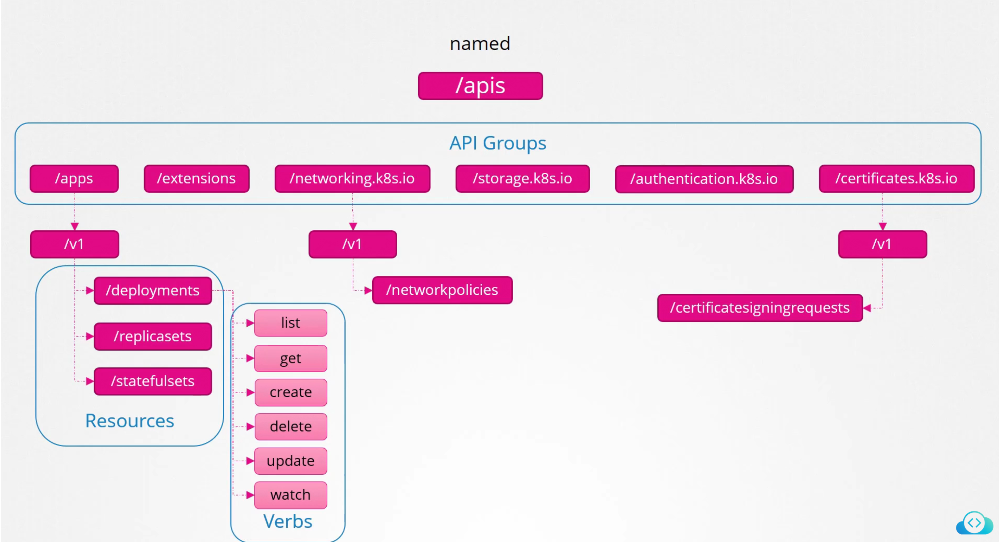
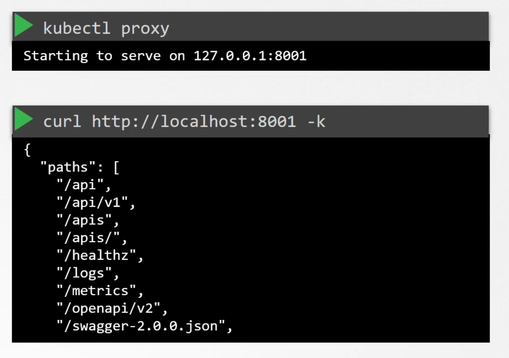

#### CIS Benchmark
best practices for security e.g. open certain ports, limit sudo, only certain services are enabled, enable auditing, logging, etc
  
Download link - https://www.cisecurity.org/cis-benchmarks/#kubernetes

Tools for CIS benchmark for kubernetes
- kube-bench
- kubescape
- trivy (all in one - also by Aqua security who performs CIS benchmark)

Install kube-bench in /root directory
```
curl -L https://github.com/aquasecurity/kube-bench/releases/download/v0.4.0/kube-bench_0.4.0_linux_amd64.tar.gz -o kube-bench_0.4.0_linux_amd64.tar.gz
tar -xvf kube-bench_0.4.0_linux_amd64.tar.gz
 ./kube-bench --config-dir `pwd`/cfg --config `pwd`/cfg/config.yaml 
```

#### Kubernetes Security Primitives

First line of defence - controlling access to the API server itself

2 questions
- who can access the api server?
  - who can authenticate to the server? 
  - ldap/tokens/certs/svc account
- what can they do?
  - rbac authorization
  - ABAC uathorization
  - node authorization
  - webhook mode

All communication between the cluster is encrypted via TLS
- kube controller manager
- kube scheduler
- kubeproxy
- kubelet

Pods by default can access other pods within the same cluster
- can be restricted by NetworkPolicy

#### Authentication
This part is securing access to k8 cluster with authentication mechanisms for administrative reasons

Users
- no way to create users like "e.g. kubectl create user user1"
- how does kube-apiserver authenticate the user?
  - user/password in a static password file
  ```
  # user-details.csv
  password123,users123,u0001,g001
  password123,users124,u0002,g002

  # kube-apiserver.service need to add 
  --basic-auth-file=user-details.csv

  curl -v -k "endpoint" -u "users123:password123"
  ```
  - static token in a static token file
  ```
  xxxxtokenxxx,user123,u001,xxx
  ```
  - certificates
  - ldap/kerberoes


#### Service Accounts
- user account used by users
- service accounts used for machines

```
# Get service account
$ kubectl describe sa serivceaccount 

# Get secret of the service account
$ kubectl describe secret secret-sa

You can get the token and utilize it with CURL to get a rest call to the kubernetes API

```

**TokenRequestAPI**
- tokens that are issued by TokenRequestAPI are audience bound, time bound and object bound, hence are more secure

**v1.24 Kubernetes**
- service account creation does not automatically create a secret due to security concerns
  
```yaml
# if you need a token, can perform the following but token will expire
$ kubectl create token <name of service account> # token name must be name as serice account

# if don't want expiry
apiVersion: v1
kind: Secret
type: kubernetes.io/service-account-token
meteadata:
    name: mysecret
    annotations:
        kubernetes.io/service-account.name: dashboard-sa
```

#### TLS

How does browser know that the cert was signed by Digicert and not by someone who says that they are Digicert?

Public keys of all CAs are all built into the browser which uses the public key of the CA to ensure legitimacy of certificate that the CA signed them

The CA make use of proper ways to ensure that they sign certificates for valid people e.g. TXT record, call, etc

Some people have an internal CA server. Can install the public key of the CA server installed on all employees' desktop and browsers for security.

Kubernetes requires at least one CA for the cluster


```
# Generating certificate
## Generate key
openssl genrsa -out cak.ey 2048

## CSR
openssl req -new -key cak.key -sub"/CN-kUBERNETES-CA" -out ca.csr

## Sign certificate
openssl x509 -req -in ca.csr -signkey ca.key -out ca.crt
```

Need to read up more?

#### Certificate Details / API

Registering a new user's cert and key to get her access into the cluster but with more users, this becomes hard to scale. We need to use the built in Certificate API

1. User can register their own key and sends out CSR to administrator
```yaml
apiVersion: certificates.k8s.io/v1beta1
kind: CertificateSigningRequest
metadata:
name: jane
spec:
groups:
- system:authenticated
usages:
- digital signature
- key encipherment
- server auth
request: LS0tLS1CRUdJTiBDRVJUUyZQV0FURSBSRVFVVJNV0xHT1RVVFJ3d01lb3ZYTlhwZW
1D0V6R3JNOTTFTVRVRU0Q0T0libVYzTFhWelp
PYXSDnZ0PVtUEWRONTdUdWTSWZRFFQ9pB
UVB0RTY0FUKU01yanBob0ZVWU1KClCGXeuemcr
NnhjOSTVndrS2xwc0t4ckxneG0zZ1dxc3ZUVT0
41TXV0T1oZXZtTVVPRnBi # Base64 encoded of CSR
```
2. Administrator can review and approve request
3. Administrator share cert with user

```
$ kubectl get csr
$ kubectl certificate approve jane
$ kubectl get csr jane -o yaml # decode signed CSR and pass to user
```

Controller Manager = component that signs the certificates for us. It has CSR-APPROVING/CSR-SIGNING internal components
- you can see the controller manager yaml got the ca.crt 
```
spec:
containers:
- command:
- kube-controller-manager
- --address=127.0.0.1
- --cluster-signing-key-file=/etc/kubernetes/pki/ca.crt
- --controllers=*,bootstrapsigner,tokencleaner
- --kubeconfig=/etc/kubernetes/controller-manager.conf
- --leader-elect=true
- --root-ca-file=/etc/kubernetes/pki/ca.crt
- --service-account-private-key-file=/etc/kubernetes/pki/sa.key
- --use-service-account-credentials=true
```

#### Kubeconfig

Without kubeconfig, if we want to call the kube api server, we need to perform the following which is a pain. We use kubeconfig to replace this as it'll contain the certificates/tokens

```
# kubectl get pods
    --server xxx:6443
    --client-key admin.key
    --client-certificate admin.crt
    --certificate-authority ca.crt
```
Hey bud, gather 'round! Let's talk about the kubeconfig file, a crucial key in your Kubernetes kingdom. Think of it like a passport that grants you access to your cluster and lets you talk to all the cool stuff inside.

What does it do?

Imagine a bunch of castle gates guarding your Kubernetes cluster. Each gate leads to different resources, like pods, services, and deployments. Now, the kubeconfig file is like a master key that opens all these gates. It stores all the authentication and authorization information you need to interact with your cluster – things like usernames, passwords, tokens, and even the location of the API server.

Why is it awesome?

- Single source of truth: No more juggling multiple logins or scattered credentials. This file becomes your one-stop shop for cluster access.
- Flexibility: You can have different kubeconfig files for different contexts, like staging and production environments. This keeps things organized and secure.
- Version control: Treat your kubeconfig file like code! Version control it to track changes and roll back if something goes wrong.

ntegrating kubeconfig and DEX in Kubernetes opens up a whole new world of flexibility and security for managing authentication and authorization within your cluster. Here's how it all works:

Imagine the scenario:

You have Kubernetes, the bustling kingdom, secured by DEX, your trusty gatekeeper.

To access the kingdom's resources (pods, deployments, etc.), users need a passport – the kubeconfig file.

But how does DEX, the gatekeeper, verify these passports and grant access? That's where integration comes in.
Two main integration approaches:

1. OpenID Connect (OIDC):

DEX acts as an OpenID Connect provider, issuing tokens to users after successful authentication (e.g., via LDAP, GitHub, or social login).
- These tokens are then embedded in the kubeconfig file using tools like dex-k8s-authenticator.
- When users run kubectl commands, the kubeconfig file presents the token to the Kubernetes API server.
- DEX verifies the token and grants access based on the user's role and permissions defined in Kubernetes RBAC (Role-Based Access Control).

Benefits:

- Centralized authentication: Manage user identities and access from a single point in DEX.
- Secure authentication: Use multi-factor authentication (MFA) and other security features offered by DEX.
- Fine-grained access control: Define granular permissions for users within Kubernetes based on their roles and DEX attributes.
- Seamless user experience: Users log in once to DEX and gain access to the Kubernetes cluster without additional configuration.

##### Integration with KeyCloak

Integrating Keycloak with kubeconfig for Kubernetes cluster access can be another fantastic option, offering similar benefits to DEX but with its own unique twists. Here's how it works:

The Keycloak Setup:

- Keycloak acts as your central identity and access management (IAM) system, managing user identities, authentication (via social login, LDAP, etc.), and authorization policies.

- You can define fine-grained roles and permissions within Keycloak for users accessing your Kubernetes cluster.
Integration Methods:

1. OpenID Connect (OIDC):

- Similar to DEX, Keycloak acts as an OIDC provider, issuing tokens to authenticated users.
- These tokens are embedded in the kubeconfig file using tools like keycloak-operator or manually configured with the Keycloak provider configuration.
- The Kubernetes API server verifies the token with Keycloak and grants access based on the user's roles and permissions within Keycloak.

Benefits:

- Centralized IAM: Manage user identities, authentication, and authorization from a single source in Keycloak.
- Fine-grained access control: Define granular roles and permissions for Kubernetes access based on Keycloak user attributes.
- Seamless user experience: Single sign-on (SSO) allows users to log in once to Keycloak and access the Kubernetes cluster without further authentication.
- Multi-factor authentication (MFA): Enhance security by enforcing MFA for cluster access through Keycloak.
 
2. Client certificates:

- Keycloak can issue client certificates to service accounts used by applications within the cluster.
- These certificates are stored in Secrets within Kubernetes and referenced in the kubeconfig file of the application pod.
- The API server verifies the certificate against the Secret object to grant access to the application.

Benefits:

- Stronger security: Client certificates offer robust authentication compared to simple static tokens.
- Automatic certificate renewal: Keycloak can automatically renew certificates before they expire, simplifying maintenance.

3. JWT token exchange:

- This involves converting Keycloak JWT tokens (obtained via authentication) into Kubernetes authentication tokens using a dedicated bridge or proxy.
- The converted tokens are then used in the kubeconfig file for API server authorization.

Benefits:

- Leverages existing Keycloak authentication workflow and token issuance.
- Can be more lightweight compared to the full OIDC integration.

Choosing the best approach:

- Consider your security requirements: OIDC and client certificates offer stronger authentication than static tokens.
- Assess your userbase and complexity: OIDC and JWT token exchange are ideal for centralized user management and fine-grained access control.
- Evaluate existing infrastructure: Leverage your existing Keycloak setup and choose the integration method that best aligns with it.

Keycloak offers a powerful and flexible option for integrating IAM with your Kubernetes cluster through kubeconfig. Weigh the options and choose the approach that best meets your specific needs and security considerations.

##### Structure of KubeConfig File
1. Clusters
   - Development
   - Production
   - Google
2. Contexts
   - Marries Clusters/Users together, which user account access which cluster?
3. Users
    - Admin
    - Dev User
    - Prod User
```
$ kubectl config view
$ kubectl config view --kubeconfig=xxx=config
$ kubectl config current-context
$ kubectl config use-context nyz-core-prod
```
```yaml
apiVersion: v1
kind: Config
clusters:
- name: my-kube-playground
cluster:
certificate-authority: ca.crt
server: https://my-kube-playground:6443
contexts:
- name: my-kube-admin@my-kube-playground
context:
cluster: my-kube-playground
user: my-kube-admin
users:
- name: my-kube-admin
user:
client-certificate: admin.crt
client-key: admin.key
```

```yaml
apiVersion: v1
kind: Config
current-context: dev-user@google # We can change this via cLI
clusters:
- name: my-kube-playground
(values hidden...)
- name: development
- name: production
- name: google
contexts:
- name: my-kube-admin@my-kube-playground
- name: dev-user@google
- name: prod-user@production
users:
- name: my-kube-admin
- name: admin
- name: dev-user
- name: prod-user
```


```yaml
# What about namespaces?
# can specify namespace in the contexts part in the kubeconfig file
apiVersion: v1
kind: Config
clusters:
- name: production
cluster-authority: /etc/kubernetes/pki/ca.crt #Specify certificate
server: https://172.17.0.51:6443
contexts:
- name: admin@production
context:
cluster: production
user: admin
namespace: finance # Specify namespace
users:
- name: admin
client-certificate: /etc/kubernetes/pki/users/admin.crt
client-key: /etc/kubernetes/pki/users/admin.key
```

#### API Groups

Different API paths. e.g.
- /api
- /metrics
- /apis
- /logs
- /version

In the context of Kubernetes, `/api` and `/apis` are both used in the Kubernetes API server, but they serve different purposes.

1. `/api`:
   - The `/api` endpoint is used for the core Kubernetes API.
   - It represents the latest stable version of the core API (e.g., `/api/v1`).
   - The core API includes resources such as pods, services, replication controllers, and namespaces.
   - These resources are considered stable and have a well-defined versioning scheme.
   - Example usage: `kubectl get pods` (uses the `/api/v1` endpoint)

2. `/apis`:
   - The `/apis` endpoint is used for API extensions and custom resources.
   - It represents the API groups and their versions.
   - API groups are used to organize and categorize related functionality in Kubernetes.
   - Custom resources, which are extensions to the Kubernetes API, are defined under `/apis`.
   - Examples of API groups include `apps`, `batch`, `extensions`, and `networking.k8s.io`.
   - Custom resources, such as CRDs (Custom Resource Definitions), are also exposed under `/apis`.
   - Example usage: `kubectl get deployments` (uses the `/apis/apps/v1` endpoint)

The key differences between `/api` and `/apis` are:
- `/api` is for the core Kubernetes API, while `/apis` is for API extensions and custom resources.
- `/api` represents the latest stable version of the core API, while `/apis` includes multiple API groups and their versions.
- The core API resources under `/api` are considered stable and have a well-defined versioning scheme, while the resources under `/apis` can have different stability guarantees depending on the API group and version.

When interacting with the Kubernetes API server, you'll use `/api` for core resources and `/apis` for API extensions and custom resources. The `kubectl` command automatically determines the appropriate endpoint based on the resource type and version you are working with.



kubectl proxy
- can use kubectl proxy - it'll take your kubectl config file as authentication
- kubeproxy != kubectl proxy
  - the former is the proxy that allows networking of pods/services between nodes
  - the latter is a http server that allows access into the cluster



#### Authorization

Think sqpc-developers-nocreate rbac role that is given to some AD group

Outsourcing authorization
- can utilize OPA that can help with admission controller, authorization, compliance and auditing, policy reusability and portability

Authorization Mode for kubernetes API server is set to AlwaysAllow by default. These are the options available
- AlwaysAllow
- Node
- abac
- rbac
- webhook
- alwaysdeny

Can specify a few modes, if mode denied the authorization, we will skip to the next mode to ask for authorization


#### RBAC

#### CLUSTER ROLES AND ROLE BINDINGS

#### KUBELET SECURITY
Kubelet registers node from the kube-apiserver, create pods and monitor pods

Ports
- 10250 - serves API that allows full access
- 10255 - serves api that allows unauthenticated read-only access

For the API, probably only can read the node pods, node level kubenetes metrics

For security of kubelet
- request must be authenticated/authorized before it reaches the kubelet
- authentication
  -  best practice is disable anonymous authentication on kubelet
  -  2 ways of authentication
     1.  certificates (x509) authentication
          - In the kubelet service, "--client-ca-file=ca.crt"
          - on the kube api server, need to have
            - kubelet cert
            - kubelet private key
     2.  api bearer tokens
         1.  ??
- authorization


#### KUBECTL PROXY + PORT FORWARD
Kubectl proxy use credentials from your kubeconfig file to access the cluster
- don't have to use curl command to access the api server

The `kubectl proxy` command is a useful tool in Kubernetes that establishes a proxy server between your local machine and the Kubernetes API server. It provides a way to access the Kubernetes API and resources securely from your local environment. Here are some key uses of `kubectl proxy`:

1. Accessing the Kubernetes API:
   - `kubectl proxy` allows you to access the Kubernetes API from your local machine using HTTP/HTTPS.
   - It sets up a proxy server that forwards requests to the API server and handles authentication and authorization.
   - You can interact with the Kubernetes API using tools like `curl` or by accessing the API endpoints directly in your web browser.

2. Testing and Debugging:
   - `kubectl proxy` is commonly used for testing and debugging purposes.
   - It provides a convenient way to access Kubernetes resources and test API requests without exposing the API server directly.
   - You can use `kubectl proxy` to troubleshoot issues, inspect API responses, and test custom controllers or operators.

3. Accessing the Kubernetes Dashboard:
   - The Kubernetes Dashboard is a web-based UI for managing and monitoring a Kubernetes cluster.
   - By running `kubectl proxy`, you can securely access the Kubernetes Dashboard from your local machine.
   - The proxy server handles the authentication and tunnels the requests to the dashboard service running in the cluster.

4. Developing and Testing API Clients:
   - When developing applications or tools that interact with the Kubernetes API, `kubectl proxy` provides a convenient way to test and debug API requests.
   - You can use `kubectl proxy` to establish a local proxy server and send API requests to the Kubernetes API without the need for complex authentication or HTTPS setup.
   - This simplifies the development process and allows you to test your API clients locally before deploying them to the cluster.

5. Accessing Cluster Services:
   - `kubectl proxy` can be used to access services running within the Kubernetes cluster from your local machine.
   - By forwarding requests through the proxy server, you can interact with cluster services using their internal DNS names or IP addresses.
   - This is useful for testing and debugging services locally without the need for exposing them externally.

To use `kubectl proxy`, you simply run the command in your terminal:

```
kubectl proxy

# To hit the web server in the default namespace on nginx service
curl http://localhost:8001/api/v1/namespaces/default/services/nginx/proxy 
```

By default, it starts the proxy server on `localhost:8001`. You can then access the Kubernetes API by sending requests to `http://localhost:8001/api/v1` or other API endpoints.

It's important to note that `kubectl proxy` is primarily intended for development, testing, and debugging purposes. It is not recommended to use `kubectl proxy` in production environments, as it bypasses some of the security measures and exposes the Kubernetes API locally. For production access to the Kubernetes API, it's recommended to use proper authentication and authorization mechanisms, such as using `kubectl` with appropriate credentials or leveraging Kubernetes API server's built-in authentication and authorization features.

`kubectl port-forward` is another useful command in Kubernetes that allows you to forward connections from your local machine to a specific pod or service running in a Kubernetes cluster. It establishes a direct connection between your local machine and the target resource, enabling you to access and interact with it securely. Here are some key uses and benefits of `kubectl port-forward`:

1. Accessing Applications Running in Pods:
   - `kubectl port-forward` is commonly used to access applications or services running inside Kubernetes pods from your local machine.
   - By specifying the pod name and the desired port mapping, you can forward a local port to a specific port on the pod.
   - This allows you to interact with the application as if it were running locally on your machine.

2. Debugging and Troubleshooting:
   - `kubectl port-forward` is useful for debugging and troubleshooting applications running in Kubernetes pods.
   - You can forward a local port to a specific pod and use tools like `curl`, web browsers, or debugging utilities to inspect and interact with the application.
   - This enables you to diagnose issues, test functionality, and gather information about the application's behavior.

3. Testing Services Locally:
   - When developing or testing services in a Kubernetes cluster, `kubectl port-forward` allows you to access those services from your local machine.
   - By forwarding a local port to a service's port, you can test the service as if it were running locally, without exposing it externally.
   - This is particularly useful during development and testing phases, as it eliminates the need to deploy the service externally or modify its configuration.

4. Secure Access to Cluster Resources:
   - `kubectl port-forward` establishes a secure connection between your local machine and the target resource in the cluster.
   - It tunnels the traffic through the Kubernetes API server, leveraging the authentication and authorization mechanisms in place.
   - This ensures that access to the resource is protected and restricted to authorized users.

To use `kubectl port-forward`, you specify the resource type (pod or service), the resource name, and the desired port mapping. For example, to forward a local port to a specific pod:

```
kubectl port-forward pod/my-pod 8080:80
```

This command forwards the local port 8080 to port 80 on the pod named `my-pod`. You can then access the pod's application by accessing `http://localhost:8080` in your local machine.

Similarly, you can forward a local port to a service by specifying the service name:

```
kubectl port-forward service/my-service 8080:80
```

This command forwards the local port 8080 to port 80 on the service named `my-service`.

It's important to note that `kubectl port-forward` is primarily intended for development, testing, and debugging purposes. It is not recommended for production use, as it requires an active `kubectl` session and does not provide load balancing or high availability. For production access to services, it's recommended to use Kubernetes Ingress, load balancers, or external services, depending on your specific requirements.

Also, keep in mind that `kubectl port-forward` is a client-side command and requires access to the Kubernetes cluster and the necessary permissions to perform the port forwarding.

#### KUBERNETES DASHBOARD
GUI for the kubernetes resources
- can edit/create resources on the cluster (need to protect access)
- when applied the default config from the kubernetes dashboard github repo, a kubernetes dashboard namespace gets created
- initially only accessible via within the cluster (clusterIP, not nodePort)
  - can utilize kubeproxy or you can expose it to access the dashboard
  - can utilize oauth2 proxy to allow admission to the dashboard
- default does not allow for any authorization
  
#### SECURING KUBERNETES DASHBOARD
To login, you can utilize
- token of a service account
- kubeconfig file 

#### VERIFY PLATFORM BINARIES
Need to compare the SHA hashes against the downloaded binaries
```
sha512sum xxx.tar.gz
shasum xxx.tar.gz
```

#### KUBERNETES SOFTWARE VERSIONS

Mainly most components cannot be ~3 minor versions older than kube api server
```
Example:

kube-apiserver is at 1.29
kubelet is supported at 1.29, 1.28, 1.27, and 1.26
```
https://kubernetes.io/releases/version-skew-policy/

#### CLUSTER UPGRADE

Info
- we can only upgrade one version at a time

Different strategies for upgrade
- add new node with newer version and remove old one until whole cluster is upgraded
- slowly upgrade one node one by one
- remember that we need to upgrade the control plane first

```
kubeadm upgrade plan # gives you a lot of information to upgrade the cluster
- it also tells you after we upgrade the control plane components, we must manually upgrade kubelets
- kubeadm only upgrades control plane components and not kubelets

# On the master nodes
yum install kubeadm=1.12.0-00
kubeadm upgrade apply v1.12.0 # Upgrade the api server to v1.12

## kubectl get nodes -> shows you version of kubelet
## now to upgrade the kubelet on the master nodes
yum -y install kubelet=1.12.0.0
systemctl restart kubelet

# Worker nodes
kubectl drain workernode01
yum -y update kubeadm=1.12
yum -y update kubelet=1.12
systemctl restart kubelet
kubectl uncordon workernode01
repeat for the other worker nodes
```

#### NETWORK POLICIES
In Kubernetes, network policies are a way to control and restrict network communication between pods within a cluster. They act as firewall rules that define which pods can communicate with each other and on which ports. Network policies provide a declarative way to enforce network segmentation and security within a Kubernetes cluster.

Key concepts of network policies:
1. Selector:
   - Network policies use label selectors to target specific pods to which the policy applies.
   - The selector determines the pods that will be subject to the rules defined in the network policy.

2. Ingress and Egress rules:
   - Network policies can define both ingress (incoming) and egress (outgoing) rules.
   - Ingress rules control the traffic that is allowed to reach the selected pods.
   - Egress rules control the traffic that the selected pods are allowed to send.

3. Allow and Deny rules:
   - Network policies can specify allow or deny rules for network traffic.
   - By default, if no network policy selects a pod, all traffic is allowed to and from that pod.
   - When a network policy selects a pod, that pod will reject any connections that are not explicitly allowed by the policy.

4. Namespaces:
   - Network policies are namespaced resources, meaning they are applied within a specific namespace.
   - Pods in one namespace can communicate with pods in another namespace if there are no network policies restricting such communication.

Benefits of using network policies:
1. Security and Isolation:
   - Network policies help in enforcing network segmentation and isolation between different parts of an application or between different applications running in the same cluster.
   - They allow you to restrict unnecessary network communication and limit the potential impact of security breaches.

2. Access Control:
   - Network policies enable fine-grained control over which pods can communicate with each other.
   - You can define rules based on pod labels, namespaces, or even IP ranges to specify allowed or denied traffic.

3. Compliance and Regulatory Requirements:
   - Network policies can help in meeting compliance and regulatory requirements by enforcing strict network access controls.
   - They provide a way to demonstrate network segmentation and secure communication within the cluster.

4. Multi-tenancy and Resource Sharing:
   - In multi-tenant environments or shared clusters, network policies are crucial for isolating tenants and ensuring that pods from different users or applications cannot communicate with each other unless explicitly allowed.

Example scenario:
Let's consider a simple example to illustrate the use of network policies. Suppose you have a frontend pod and a backend pod in the same namespace. You want to allow the frontend pod to communicate with the backend pod on a specific port, but you want to restrict all other incoming and outgoing traffic.

You can create a network policy that selects the backend pod and allows ingress traffic from the frontend pod on the specified port. Additionally, you can create another network policy that selects the frontend pod and allows egress traffic to the backend pod on the same port. All other traffic will be denied by default.

By applying these network policies, you ensure that only the necessary communication between the frontend and backend pods is allowed, while other unauthorized traffic is blocked.

Network policies are a powerful tool for securing and controlling network communication within a Kubernetes cluster. They provide a declarative and flexible way to enforce network segmentation, access control, and isolation between pods. By leveraging network policies, you can enhance the security posture of your applications and protect against unauthorized access and potential security breaches.

Certainly! Let's go through each key concept of network policies in Kubernetes and provide examples of how to implement them.

1. Selector:
   - Selectors are used to target pods to which the network policy applies.
   - You can use label selectors to match pods based on their labels.
   - Example:
     ```yaml
     apiVersion: networking.k8s.io/v1
     kind: NetworkPolicy
     metadata:
       name: frontend-policy
     spec:
       podSelector:
         matchLabels:
           app: frontend
       # ...
     ```
     In this example, the network policy selects pods with the label `app: frontend`.

2. Ingress and Egress rules:
   - Ingress rules control incoming traffic to the selected pods, while egress rules control outgoing traffic from the selected pods.
   - Example:
     ```yaml
     apiVersion: networking.k8s.io/v1
     kind: NetworkPolicy
     metadata:
       name: backend-policy
     spec:
       podSelector:
         matchLabels:
           app: backend
       ingress:
       - from:
         - podSelector:
             matchLabels:
               app: frontend
         ports:
         - protocol: TCP
           port: 80
       egress:
       - to:
         - ipBlock:
             cidr: 192.168.0.0/16
         ports:
         - protocol: TCP
           port: 5432
     ```
     In this example, the network policy allows incoming traffic from pods with the label `app: frontend` on TCP port 80 and allows outgoing traffic to the IP range `192.168.0.0/16` on TCP port 5432.

3. Allow and Deny rules:
   - Network policies can specify allow or deny rules for traffic.
   - By default, if no network policy selects a pod, all traffic is allowed.
   - Example:
     ```yaml
     apiVersion: networking.k8s.io/v1
     kind: NetworkPolicy
     metadata:
       name: deny-all
     spec:
       podSelector: {}
       ingress: []
     ```
     In this example, the network policy selects all pods in the namespace (empty pod selector) and defines an empty ingress rule, effectively denying all incoming traffic to those pods.

4. Namespaces:
   - Network policies are namespaced resources and apply to pods within a specific namespace.
   - You can create network policies in each namespace to control traffic between pods in different namespaces.
   - Example:
     ```yaml
     apiVersion: networking.k8s.io/v1
     kind: NetworkPolicy
     metadata:
       name: namespace-policy
       namespace: frontend
     spec:
       podSelector:
         matchLabels:
           app: frontend
       ingress:
       - from:
         - namespaceSelector:
             matchLabels:
               purpose: backend
         - ports:
           - protocol: TCP
             port: 3306 
     ```
     In this example, the network policy is created in the `frontend` namespace and allows incoming traffic from pods in namespaces labeled with `purpose: backend`.

These examples demonstrate how to implement the key concepts of network policies in Kubernetes. You can combine selectors, ingress and egress rules, allow and deny rules, and namespace scoping to create fine-grained network policies that suit your specific security and communication requirements.

Remember to apply the network policies to your cluster using the `kubectl apply -f <policy-file>.yaml` command. Kubernetes will enforce the network policies on the selected pods based on the defined rules.

It's important to note that for network policies to take effect, your Kubernetes cluster must have a network plugin that supports network policies, such as Calico or Cilium. Make sure your cluster is configured with a compatible network plugin to leverage the full functionality of network policies. Flannel does not support Network Policies.

#### DEVELOPING NETWORK POLICIES
```
apiVersion: networking.k8s.io/v1
kind: NetworkPolicy
metadata:
  name: db-netpol
spec:
  podSelector:
    matchLabels:
      role: db
  policyTypes:
  - Ingress
  ingress:
  - from:
    - podSelector:
        matchLabels:
          name: api-pod
    - namespaceSelector:
        matchLabels:
          name: prod
    - ipBlock:
        cidr: 192.168.5.10/32
    ports:
    - protocol: TCP
      port: 3306
```
Putting a "-" there would mean that if any of the 3 policies pass, the traffic will go through

This is not the same as 

```
apiVersion: networking.k8s.io/v1
kind: NetworkPolicy
metadata:
  name: db-netpol
spec:
  podSelector:
    matchLabels:
      role: db
  policyTypes:
  - Ingress
  ingress:
  - from:
    - podSelector:
        matchLabels:
          name: api-pod
      namespaceSelector:
        matchLabels:
          name: prod
    - ipBlock:
        cidr: 192.168.5.10/32
    ports:
    - protocol: TCP
      port: 3306
```

For this, there are two rules, one with podSelector and namespaceSelector combined. For this rule to pass, both conditions must be met.

#### INGRESS

Nginx controller
- monitors the ingresses in the namespace and adds the redirection if needed. This requires a nginx service acount
- need to have the configmap to configure the nginx config e.g. SSL termination, etc

```yaml
---
apiVersion: networking.k8s.io/v1beta1
kind: Ingress
metadata:
  name: nginx-ingress
  labels:
    name: nginx-ingress
spec:
  rules:
  - http:
      paths:
      - path: /
        backend:
          serviceName: nginx-ingress
          servicePort: 80

---
apiVersion: v1
kind: Service
metadata:
  name: nginx-ingress
  labels:
    name: nginx-ingress
spec:
  type: NodePort
  ports:
  - port: 80
    targetPort: 80
    protocol: TCP
    name: http
  - port: 443
    targetPort: 443
    protocol: TCP
    name: https
  selector:
    name: nginx-ingress
    
---
apiVersion: v1
kind: ConfigMap
metadata:
  name: nginx-configuration
  
---
apiVersion: v1
kind: ServiceAccount
metadata:
  name: nginx-ingress-serviceaccount
  
---
kind: ConfigMap
apiVersion: v1
metadata:
  name: nginx-configuration
```
Ingress resource
- rules applied to the nginx resource to redirect to different service based on the URL (e.g. domain or prefix)
```yaml
apiVersion: extensions/v1beta1
kind: Ingress
metadata:
  name: ingress-wear-watch
spec:
  rules:
  - host: wear.my-online-store.com
    http:
      paths:
      - path: /wear
        backend:
          serviceName: wear-service
          servicePort: 80
      - path: /watch
        backend:
          serviceName: watch-service
          servicePort: 80
```
#### Ingress – Annotations and rewrite-target
Different ingress controllers have different options that can be used to customise the way it works. NGINX Ingress controller has many options that can be seen here. I would like to explain one such option that we will use in our labs. The Rewrite target option.

Our watch app displays the video streaming webpage at http://<watch-service>:<port>/

Our wear app displays the apparel webpage at http://<wear-service>:<port>/

We must configure Ingress to achieve the below. When user visits the URL on the left, his request should be forwarded internally to the URL on the right. Note that the /watch and /wear URL path are what we configure on the ingress controller so we can forwarded users to the appropriate application in the backend. The applications don’t have this URL/Path configured on them:

```
http://<ingress-service>:<ingress-port>/watch –> http://<watch-service>:<port>/

http://<ingress-service>:<ingress-port>/wear –> http://<wear-service>:<port>/
```

Without the rewrite-target option, this is what would happen:
```
http://<ingress-service>:<ingress-port>/watch –> http://<watch-service>:<port>/watch

http://<ingress-service>:<ingress-port>/wear –> http://<wear-service>:<port>/wear
```
Notice watch and wear at the end of the target URLs. The target applications are not configured with /watch or /wear paths. They are different applications built specifically for their purpose, so they don’t expect /watch or /wear in the URLs. And as such the requests would fail and throw a 404 not found error.

To fix that we want to “ReWrite” the URL when the request is passed on to the watch or wear applications. We don’t want to pass in the same path that user typed in. So we specify the rewrite-target option. This rewrites the URL by replacing whatever is under rules->http->paths->path which happens to be /pay in this case with the value in rewrite-target. This works just like a search and replace function.

For example: replace(path, rewrite-target)

In our case: replace("/path","/")
```yaml
apiVersion: networking.k8s.io/v1 
kind: Ingress
metadata:
  name: test-ingress
  namespace: critical-space
  annotations:
    nginx.ingress.kubernetes.io/rewrite-target: /
spec:
  rules:
  - http:
      paths:
      - path: /pay
        pathType: Prefix
        backend:
          service:
            name: pay-service
            port: 
              number: 8282
```
In another example given here, this could also be:

replace("/something(/|$)(.*)", "/$2")

```yaml
apiVersion: networking.k8s.io/v1
kind: Ingress
metadata:
  annotations:
    nginx.ingress.kubernetes.io/rewrite-target: /$2
  name: rewrite
  namespace: default
spec:
  rules:
  - host: rewrite.bar.com
    http:
      paths:
      - backend:
         service:
          name: http-svc
          port: 
           number: 80
        path: /something(/|$)(.*)
        pathType: Prefix
```

#### DOCKER

docker service configuration
- need the /etc/docker/daemon.json file which could contain the messages as follows
```json
{
  "debug": true,
  "hosts": ["tcp://192.168.1.10:2376"],
  "tls": true,
  "tlscert": "/var/docker/server.pem",
  "tlskey": "/var/docker/serverkey.pem"
}
```

```bash
$ dockerd --debug
runs a docker daemon with debug mode. It listens to a internal unix socket at /var/run/docker.sock

Unix socket - inter process communication used to communicate between processes within the same host (only can interact with the localhost)

what if we need to connect from outside the host?
- ask docker to listen to a TCP port like

$ dockerd --debug --host=tcp://192.168.1.10:2375
To access this docker daemon from other hosts

#host 2
$ export DOCKER_HOST="tcp://192.168.1.10:2375"
$ docker ps

# To add encryption
$ dockerd --debug --host=... --tls=true --tlscert=cert.pem --tls=key.pem
```
#### Securing Docker Server
- TLS port of docker server: 2376 (encrypted), 2375 (unencrypted)
- Enable SSH key based authentication
- Determine users who needs access to the server


#### SECURING CONTROL PLANE