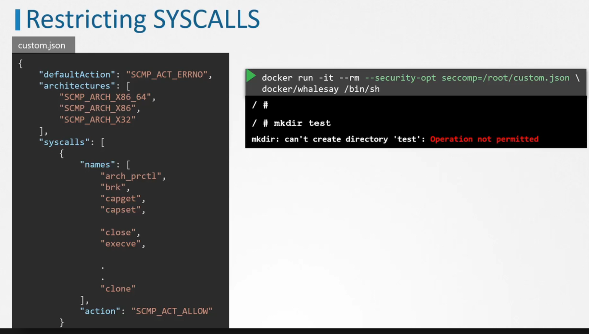
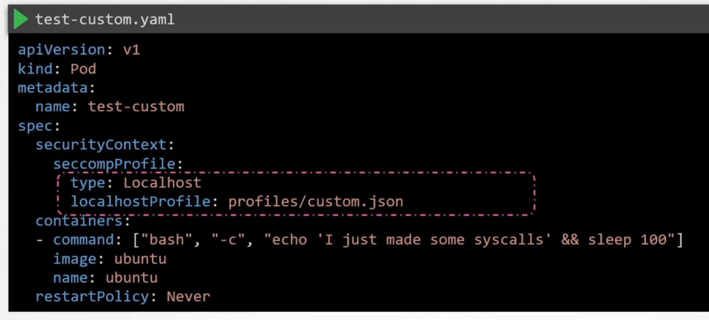

#### Least Privilege Principle / Minimize host OS footprint
- Limit Node Access
- remove internet access, add firewall 
- SSH Hardening
  - use ssh key for authentication
  - CIS benchmarks
- Privilege Escalation in Linux
- Remove Obsolete Packages and Services

#### Restrict Kernel Modules
- blacklist modules in /etc/modprobe.d/blacklist.conf
  - blacklist sctp
  - black dccp (which kernels to blacklist?)
- Might be worth black listing certain network modules if not needed by the CNI
```
# list modules
lsmod
```
#### Identify and disable open ports
Find out what ports are required. Disable the rest.
#### Minimize IAM roles
Least privilege access. If they never use their privilege, remove them. There are tools for this.
#### Minimize external access to the network
Tools to restrict access to the servers
- netstat -an | grep -w LISTEN
- /etc/services file
- physical/software firewalls devices
  
#### UFW Firewall Basics
UFW (Uncomplicated Firewall)
- UFW is a frontend interface for IP tables
```bash
ufw status
ufw default allow outoging
ufw default deny incoming
ufw allow from 172.16xx to any port 22 proto tcp
ufw enable
ufw status -> show rule status
ufw delete 5 -> delete rule 5
```
#### Linux Syscalls
When a process runs in Linux, it interacts with the kernel through system calls (syscalls) to request resources, perform I/O operations, and carry out other tasks. Let's dive into what happens under the hood and explore syscalls in more detail.

1. User Space and Kernel Space:
   - In Linux, the memory is divided into two regions: user space and kernel space.
   - User space is where user processes run, and they have limited access to system resources.
   - Kernel space is where the kernel resides and has complete access to system resources.

2. Process Execution:
   - When a process is executed, it runs in user space.
   - The process contains instructions that are executed by the CPU.
   - When the process needs to interact with the kernel or perform a privileged operation, it makes a syscall.

3. System Calls (Syscalls):
   - Syscalls are the interface between user space and kernel space.
   - They provide a way for user processes to request services from the operating system kernel.
   - Examples of syscalls include `open()`, `read()`, `write()`, `fork()`, `exec()`, etc.

4. Syscall Mechanism:
   - When a process makes a syscall, it triggers a software interrupt or trap.
   - The CPU switches from user mode to kernel mode, giving the kernel full control.
   - The kernel then handles the syscall request based on the syscall number and arguments.

5. Syscall Handler:
   - The kernel has a syscall handler that maps the syscall number to the corresponding kernel function.
   - The syscall handler validates the arguments passed by the user process.
   - It then invokes the appropriate kernel function to perform the requested operation.

6. Kernel Functions:
   - The kernel functions are responsible for carrying out the actual work requested by the syscall.
   - They have access to kernel data structures and can perform privileged operations.
   - Examples include accessing hardware devices, managing memory, handling files, etc.

7. Returning from Syscall:
   - Once the kernel function completes its work, it prepares the result to be returned to the user process.
   - The kernel switches back from kernel mode to user mode.
   - The user process resumes execution with the result of the syscall.

8. Syscall Performance:
   - Syscalls have an overhead because they involve switching between user mode and kernel mode.
   - However, they are optimized to minimize the performance impact.
   - Techniques like syscall batching and syscall avoidance are used to reduce the number of syscalls made by processes.

9. Syscall Tracing:
   - Linux provides tools like `strace` that allow you to trace the syscalls made by a process.
   - Tracing syscalls can be useful for debugging, performance analysis, and understanding process behavior.

Understanding syscalls is crucial for low-level programming, system programming, and kernel development in Linux. They provide a powerful mechanism for processes to interact with the operating system and access system resources in a controlled manner.

#### ePBF
It's worth noting that while syscalls are the fundamental interface, higher-level libraries and frameworks often provide abstractions and wrappers around syscalls to simplify application development.

Sure! Let me explain eBPF (Extended Berkeley Packet Filter) and how it relates to the Linux kernel and syscalls in a way that's easy to understand for a junior engineer.

Imagine you have a big factory (the Linux kernel) with many workers (processes) doing different tasks. The workers often need to request things from the factory management (syscalls) to get their work done. The factory management has strict rules and procedures to handle these requests.

Now, the factory owner introduces a new tool called eBPF. It's like a special magnifying glass that allows you to inspect and analyze what's happening inside the factory without disrupting the work.

Here's how eBPF comes into the picture:

1. Observability:
   - With eBPF, you can observe and collect data about various aspects of the factory (kernel).
   - You can track the requests made by workers (syscalls), monitor their performance, and gather metrics.
   - This helps in understanding how the factory is running and identifying any bottlenecks or inefficiencies.

2. Tracing and Profiling:
   - eBPF allows you to trace and profile specific parts of the factory (kernel) in real-time.
   - You can attach eBPF programs to specific events or locations in the factory, such as when a worker makes a request (syscall).
   - These programs can collect detailed information about the event, such as the worker's ID (process ID), the type of request (syscall number), and the time taken to process the request.

3. Extending Functionality:
   - eBPF also allows you to extend the functionality of the factory (kernel) without modifying its core components.
   - You can write custom eBPF programs that define new behaviors or implement additional logic.
   - For example, you can create an eBPF program that automatically routes requests (syscalls) to different parts of the factory based on certain conditions.

4. Safety and Efficiency:
   - eBPF programs run in a safe and restricted environment within the factory (kernel).
   - They have limited access to factory resources and follow strict rules to ensure they don't interfere with the factory's normal operations.
   - eBPF programs are designed to be efficient and have minimal overhead, so they don't slow down the factory's work.

5. Tooling and Ecosystem:
   - There are various tools and libraries available that make it easier to work with eBPF.
   - These tools provide high-level abstractions and help in writing, compiling, and loading eBPF programs into the factory (kernel).
   - Examples of such tools include BCC (BPF Compiler Collection), bpftrace, and libbpf.

In summary, eBPF is like a powerful tool that allows you to observe, analyze, and extend the behavior of the Linux kernel without disrupting its normal functioning. It provides a way to gain deep insights into kernel events, trace syscalls, and add custom functionality safely and efficiently.

Tracing system calls
```
strace touch /tmp/error.log
strace -p <pid>
strace -c touch /tmp/error.log # See all the syscalls used and time taken
```
#### AquaSec Tracee

Functions
- trace syscalls on a container
- utilizes ePBF to trace system calls during runtime

Tracee, with its eBPF-based capabilities, is being used to enhance Kubernetes security in several ways. Let's explore how Tracee is applied in the context of Kubernetes:

1. Runtime Security Monitoring:
   - Tracee can be deployed as a daemonSet in Kubernetes to monitor the runtime behavior of containers and nodes.
   - It uses eBPF to trace system events and syscalls within the containers and the underlying host system.
   - Tracee can detect and alert on suspicious activities, such as unauthorized process execution, privilege escalation attempts, or abnormal network connections.

2. Kubernetes-Specific Security Policies:
   - Tracee integrates with Kubernetes to enforce security policies specific to the Kubernetes environment.
   - It can monitor Kubernetes-related events, such as pod creation, container starts, and API server requests.
   - Security policies can be defined to detect and prevent actions that violate Kubernetes best practices or security guidelines, such as running containers with elevated privileges or accessing sensitive Kubernetes resources.

3. Container Runtime Security:
   - Tracee can provide runtime security for containers running in Kubernetes.
   - It can monitor and analyze the behavior of containers, including their interactions with the host system and other containers.
   - Tracee can detect and prevent container breakout attempts, where an attacker tries to escape the container boundaries and gain access to the underlying host or other containers.

4. Network Security Monitoring:
   - Tracee can monitor network activity within the Kubernetes cluster using eBPF.
   - It can trace network connections, protocol usage, and data transfers between containers and services.
   - Tracee can detect and alert on suspicious network patterns, such as unauthorized connections, port scanning attempts, or data exfiltration.

5. Forensic Analysis and Incident Response:
   - In the event of a security incident in a Kubernetes cluster, Tracee can provide valuable forensic information.
   - It captures detailed logs and traces of system events, container activities, and network communications.
   - This information can be used to investigate the incident, identify the root cause, and perform post-mortem analysis.
   - Tracee's forensic capabilities help in understanding the scope and impact of a security breach and aid in incident response efforts.

6. Integration with Kubernetes Security Ecosystem:
   - Tracee can integrate with other Kubernetes security tools and platforms to provide a comprehensive security solution.
   - It can feed the security events and alerts generated by Tracee into Kubernetes-native security tools, such as Falco or Kubernetes Audit Logging.
   - This integration allows for centralized security monitoring, alerting, and management within the Kubernetes ecosystem.

By leveraging eBPF, Tracee brings deep visibility and runtime security capabilities to Kubernetes environments. It helps in detecting and preventing security threats, enforcing Kubernetes-specific security policies, and providing forensic analysis for incident response.

Tracee complements other Kubernetes security measures, such as network policies, role-based access control (RBAC), and container image scanning. It adds an additional layer of runtime security monitoring and anomaly detection, enhancing the overall security posture of Kubernetes clusters.

As Kubernetes continues to be widely adopted, tools like Tracee play a crucial role in securing containerized workloads and ensuring the integrity and confidentiality of applications running in Kubernetes environments.

Pre-requisites before installing tracee
- easier to run as a docker and dump it into /tmp/tracee
- needs access to kernel headers - /lib/modules, /usr/src
- need to add the privileged flag on docker

Tracing syscalls
- add the "--trace pid=new" or "--container=new" flag to the docker run comand depending on usage
- 
#### Restrict syscalls using seccomp
No one application really needs access to all syscalls (total ~135+ syscalls in Linux). This increases attack surface

seccomp (secure computation)= kernel level feature to sandbox applications to use the syscalls they need 

how to check if seccomp is supported by your kernel
```bash
grep -i seccomp /boot/config-$(uname -r)
```

seccomp got 3 modes
- mode 0 - disabled
- mode 1 - strict (only allow 4 syscalls)
- mode 2 - filtered (when you run docker, can mention what syscalls the docker container can calls)

There are default blocked syscalls from docker by default (exists in some files)



#### Implement Seccomp in Kubernetes

Certainly! Seccomp (Secure Computing) is a security feature in Linux that allows restricting the system calls a process can make. In the context of Kubernetes, seccomp is used to enhance the security of containers by limiting the syscalls they can execute.

Here's how seccomp works in Kubernetes:

1. Seccomp Profiles:
   - Seccomp profiles define the allowed and blocked syscalls for a container.
   - Kubernetes provides a default seccomp profile that blocks a subset of syscalls considered potentially dangerous.
   - Custom seccomp profiles can be created to further restrict or allow specific syscalls based on the application's requirements.

2. Applying Seccomp to Containers:
   - Seccomp profiles can be applied to containers using the `securityContext` field in the pod or container specification.
   - The `securityContext.seccompProfile.type` field specifies the type of seccomp profile to use, such as "RuntimeDefault" (default profile) or "Localhost" (custom profile).
   - When a custom profile is used, the `securityContext.seccompProfile.localhostProfile` field specifies the path to the custom seccomp profile file on the node.

3. Syscall Filtering:
   - When a container is started with a seccomp profile, the specified syscalls are filtered and controlled.
   - If a container attempts to make a syscall that is not allowed by the seccomp profile, the syscall is blocked, and the container may be terminated or receive an error.
   - Seccomp profiles can be used to prevent containers from executing potentially harmful syscalls, such as those related to process creation, filesystem access, or network operations.

4. Auditing and Logging:
   - Seccomp violations, where a container attempts to make a blocked syscall, can be logged and audited.
   - Kubernetes provides mechanisms to capture and analyze seccomp audit logs, allowing administrators to monitor and investigate any attempts to bypass the defined seccomp restrictions.

5. Best Practices:
   - It's recommended to start with the default seccomp profile provided by Kubernetes and gradually customize it based on the specific needs of the application.
   - Seccomp profiles should be carefully defined to ensure that the necessary syscalls for the container's functionality are allowed while restricting unnecessary or potentially dangerous syscalls.
   - Regular testing and validation should be performed to ensure that the seccomp profiles do not break the application's functionality.

Benefits of using seccomp in Kubernetes:
- Enhanced container security by limiting the attack surface and preventing the execution of unwanted or malicious syscalls.
- Mitigation of container breakout risks by restricting the capabilities of a compromised container.
- Compliance with security best practices and regulatory requirements that mandate syscall restrictions.
- Improved overall security posture of the Kubernetes cluster by providing an additional layer of defense.

It's important to note that seccomp is just one of the security features available in Kubernetes. It should be used in conjunction with other security measures, such as network policies, RBAC, and container image scanning, to provide a comprehensive security solution for containerized applications.

Kubernetes administrators and developers should carefully evaluate the security requirements of their applications and configure seccomp profiles accordingly to strike a balance between security and functionality.


Define seccomp profiles (which syscalls your app to use) for each application - tedious

#### AppArmor
AppArmor is a Linux security module that provides mandatory access control (MAC) for processes and files. It allows administrators to define profiles that restrict the capabilities and permissions of individual applications or containers. AppArmor is commonly used in Kubernetes to enhance the security of containerized workloads.

Here's how AppArmor is used in Kubernetes:

1. AppArmor Profiles:
   - AppArmor profiles define the permitted actions and resources that a process or container can access.
   - Profiles are written in a specific syntax and stored in files on the host system.
   - Kubernetes provides a set of default AppArmor profiles that can be used as a starting point for securing containers.

```bash
# Generate app armor profile
apt-get install apparmor
aa-genprof <script>
./run_script.sh
Answer Y/N to questions asked to generate the security profile
aa-status will show you a new apparmor profile - which is stored in /etc/apparmor.d/<script>
```
2. Applying AppArmor Profiles to Containers:
   - AppArmor profiles can be applied to containers using the `metadata.annotations` field in the pod specification.
   - The `container.apparmor.security.beta.kubernetes.io/<container-name>` annotation is used to specify the AppArmor profile for a specific container.
   - The value of the annotation should match the name of the AppArmor profile loaded on the host system.

3. Profile Enforcement:
   - When a container is started with an AppArmor profile, the kernel enforces the restrictions defined in the profile.
   - If a container attempts to perform an action that is not allowed by the profile, the action is blocked, and an error is logged.
   - AppArmor profiles can restrict various aspects of container behavior, such as file access, network operations, and capability usage.

4. Default Profiles:
   - Kubernetes provides a set of default AppArmor profiles that can be used to secure containers.
   - The default profiles, such as `runtime/default` and `unconfined`, provide different levels of restrictions.
   - Administrators can choose to use the default profiles or create custom profiles tailored to their specific security requirements.

5. Host System Configuration:
   - To use AppArmor in Kubernetes, the host system (worker nodes) must have AppArmor installed and enabled.
   - AppArmor profiles need to be loaded into the kernel on each host system where containers will be running.
   - Kubernetes administrators are responsible for ensuring that the necessary AppArmor profiles are available on the worker nodes.

Benefits of using AppArmor in Kubernetes:
- Fine-grained control over the actions and resources accessible to containers, reducing the potential impact of security vulnerabilities.
- Prevention of container breakouts by limiting the capabilities and permissions of compromised containers.
- Enforcement of the principle of least privilege, ensuring that containers only have access to the resources they require.
- Compliance with security best practices and regulatory requirements that mandate access controls for containerized applications.

It's important to note that AppArmor is just one of the security mechanisms available in Kubernetes. It should be used in combination with other security features, such as seccomp, network policies, and RBAC, to provide a comprehensive security solution.

Kubernetes administrators should carefully define and manage AppArmor profiles based on the specific security needs of their applications. Regular testing and monitoring should be conducted to ensure that the profiles are effective and do not interfere with the normal operation of the containers.

Using AppArmor in Kubernetes helps to mitigate security risks and provides an additional layer of defense against potential attacks or misconfigurations in containerized environments.
#### Creating AppArmor Profiles
#### AppArmor in Kubernetes
AppArmor kernel module and profiles must be enabled on all nodes in the kubernetes cluster

```bash
# To check if profile exists on all nodes, run this on all node
aa-status | grep <profile> 
```

### Linux Capabilities 
Certainly! Linux capabilities are a set of privileges that can be granted to processes to perform specific actions. They provide a more fine-grained approach to process permissions compared to the traditional "all-or-nothing" superuser (root) model. Let me explain some common Linux capabilities to a junior engineer:

1. CAP_NET_ADMIN:
   - This capability allows a process to perform network-related administrative tasks.
   - With CAP_NET_ADMIN, a process can modify network interfaces, configure IP addresses, and manage routing tables.
   - For example, a process with CAP_NET_ADMIN can set up a virtual network interface or change the system's network configuration.

2. CAP_SYS_ADMIN:
   - CAP_SYS_ADMIN is a broad capability that grants a process various system administration privileges.
   - It allows a process to perform tasks such as mounting and unmounting filesystems, modifying kernel parameters, and controlling system resources.
   - Processes with CAP_SYS_ADMIN should be carefully managed as they have significant control over the system.

3. CAP_SYS_PTRACE:
   - This capability allows a process to use the ptrace system call to monitor and control other processes.
   - With CAP_SYS_PTRACE, a process can attach to another process, inspect its memory, and modify its execution.
   - Debugging tools and system monitoring utilities often require CAP_SYS_PTRACE to perform their tasks.

4. CAP_DAC_OVERRIDE:
   - CAP_DAC_OVERRIDE allows a process to bypass file read, write, and execute permission checks.
   - It enables a process to access files and directories regardless of the discretionary access control (DAC) permissions set by the file owner.
   - This capability should be used with caution as it can potentially allow unauthorized access to sensitive files.

5. CAP_CHOWN:
   - The CAP_CHOWN capability allows a process to change the ownership of files and directories.
   - Normally, only the superuser (root) can change file ownership, but with CAP_CHOWN, a process can perform ownership modifications without being root.
   - This capability is often required by file management utilities and backup tools.

6. CAP_SETUID and CAP_SETGID:
   - These capabilities allow a process to change its user ID (UID) and group ID (GID) respectively.
   - With CAP_SETUID, a process can set its UID to any value, including the root UID (0).
   - Similarly, CAP_SETGID allows a process to set its GID to any value.
   - These capabilities are commonly used by privilege elevation mechanisms and setuid programs.

7. CAP_NET_BIND_SERVICE:
   - CAP_NET_BIND_SERVICE allows a process to bind to privileged ports (ports below 1024).
   - Normally, only processes running as root can bind to privileged ports, but with this capability, a non-root process can bind to these ports.
   - This capability is often required by network services and daemons that need to listen on privileged ports.

These are just a few examples of Linux capabilities. There are many more capabilities available, each granting specific privileges to processes. The idea behind capabilities is to provide a more granular and controlled way to assign privileges, following the principle of least privilege.

When working with Linux capabilities, it's important to carefully consider which capabilities are necessary for a process to perform its intended functions. Granting unnecessary capabilities can potentially increase the attack surface and pose security risks. Therefore, it's recommended to assign capabilities judiciously and regularly review the capabilities assigned to processes to ensure they align with the system's security requirements.

```bash
# What capabilities does a process need?
$ getcap /usr/bin/ping
/usr/bin/ping = cap_net_raw+ep

#Find capabilities used by a process
getpcaps <pid>

# This pod can change time but cannot chown permissions
apiVersion: v1
kind: Pod
metadata:
 name: ubuntu-sleeper
spec:
 containers:
 - name: ubuntu-sleeper
   image: ubuntu
   command: [ "sleep", "1000" ]
   securityContext:
     capabilities:
       add: ["SYS_TIME"]
       drop: ["CHOWN"]
```