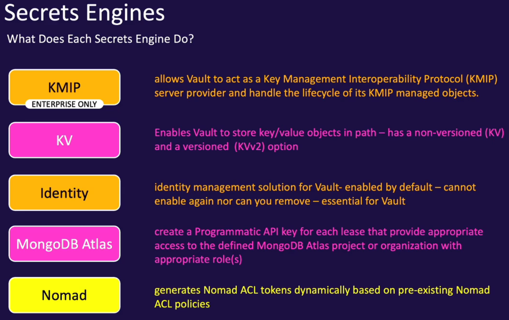

# Secret Engine
- the reason why you use vault
- component to store/generate/encrypt data
- many secret engines can be enabled in Vault
  - enable multiple instances of the same secrets engines e.g. enable 20 kvv2 stores
- secret engines are plugins that extend functionality of vault
  - can create your own vault + use community plugins
- are enabled and isolated at path (must be unique)

### Secrets as a service
- use Vault to generate and manage lifecycle of credentails
- no more sharing credentials
- creds can revoked at the end of lease
- use policies to control access based on clients' role

### What does each secret engine do?

## Enabling a secrets engine
- Cubbyhole and Identity are enabled by default (can't disable)
- Responsibilities
  - Admins
    - Enable secret engine
    - Configure connection to backend e.g. AWS/DB
    - Create role that define perms to the backend platform
    - Create policies that grant permissions to read from the secret engine
  - Clients
    - read a set of credentials using token and associated policy
    - renew the lease before its expiration if needed
    - renew the token if needed

`vault secrets disable/enable/list/move/tune`
`format: vault secrets enable path-xxx <secret-engine e.g. kvv2> `
`e.g. vault secrets enable aws`
` vault secrets list -detailed`
` vault secrets enable -path=developers kv`
` vault secrets enable -description="xxx" kv`

### Dynamic Secrets Engine

Generally 2 steps when configuring a secrets engine that will generate dynamic credentials
1. Configure Vault with access to the platform
   - AWS
     - vault needs creds (IAM creds, ec2 instance role, etc )to interact with aws
     - `vault write aws/config/root \`
    `   access_key=xxx \`
    `   secret_key=xxx \`
    `   region=us-east-1`
   - Database
      - 
2. Configure roles based on permissions needed
    - Vault does not know what perms, groups policies you want to attach to generated credentials
    - Each role maps to a set of permissions on a targetd platform
    - Roles e.g. readonly/fulladmin/reads3/listec2
    - AWS
      - 
    - DB
      - 

