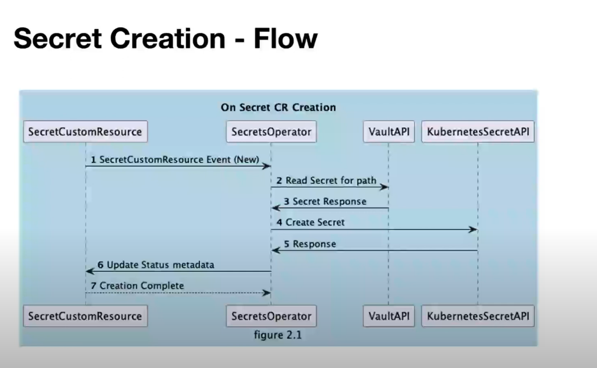

**Vault Secrets Operator**

- A set of CRDs responsible for syncing secrets to Kubernetes Secrets
- Responsible for secret rotation and provides controllers for handling various specific CRDs
- Capable of performing post-rotation actions, such as HTTP requests and triggering rolling updates of deployments

**List of Secrets that we can sync**

| CRD Secret| Example YAML file |
|---|---|
| VaultStaticSecret | `vault/vault-static-secret.yaml` |
| VaultDynamicSecret | `vault/vault-dynamic-secret.yaml` |
| VaultPKISecret | `vault/vault-pki-secret.yaml` |

**Custom Resource Definitions**

- **VaultAuth:** Provides configuration for the Operator to authenticate to a single Vault server as specified in VaultConnection
- **VaultConnection:** Provides configuration necessary for the Operator to connect to a single Vault server
- **VaultStaticSecret:** A static secret from Vault
- **VaultDynamicSecret:** A dynamic secret from Vault
- **VaultPKISecret:** A PKI secret from Vault

**Helm Charts**

- Helm charts for the Vault Secrets Operator
- When you deploy this, you create the CRDs only.

**Operators**

- Controllers that execute loops to check current state and desired state
- May or may not reconcile the states

**Our usage**

- We separate VaultConnection/VaultAuth in each namespace, which isolates authentication and connection details to specific namespaces.
- By defining CRDs per namespace, you can control which namespaces have access to specific secrets. --> Not confirmed

**Secret Creation - Flow**

**Configure Vault Kubernetes Auth Method**

**On Vault's end:**

Configure Vault Kubernetes Auth Method

1. Enable Kubernetes Auth Method
`
$ vault auth enable -path demo-auth-mount kubernetes
`

2. Configure Auth Method
`
~ vault write auth/demo-auth-mount/config \
   kubernetes_host="https://$KUBERNETES_PORT_443_TCP_ADDR:443"
`

3. Enable kvv2 secret engine
`
$ vault secrets enable -path=kvv2 kv-v2  # Enable kvv2 secret engine
`

4. Create read only policy
`
$ vault policy write dev - <<EOF \
   path "kvv2/*" {
    capabilities = ["read"]
   }
EOF
`

5. Create a role in Vault to enable access to secret.
Notice that the bound_service_account_namespaces is app, limiting where the secret is synced to
`
$ vault write auth/demo-auth-mount/role/role1 \
   bound_service_account_names=default \
   bound_service_account_namespaces=app \
   policies=dev \
   audience=vault \
   ttl=24h
`

6. Create a secret
`
vault kv put kvv2/webapp/config username="static-user" password="static-password"
`
[operator](https://developer.hashicorp.com/vault/tutorials/kubernetes/vault-secrets-operator)

# On VSO end
1. install VSO on VSO namespace via helm
2. Create a namespace called app on cluster
`
$ kubectl create ns app
`
3. Set up authentication for this secret
`
$ kubectl apply -f vault/vault-auth-static.yaml
    apiVersion: secrets.hashicorp.com/v1beta1
    kind: VaultAuth
    metadata:
    name: static-auth
    namespace: app
    spec:
    method: kubernetes
    mount: demo-auth-mount
    kubernetes:
        role: role1
        serviceAccount: default
        audiences:
        - vault
`